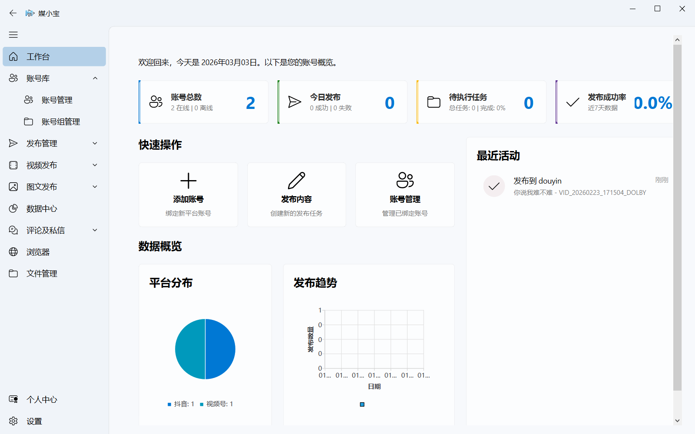
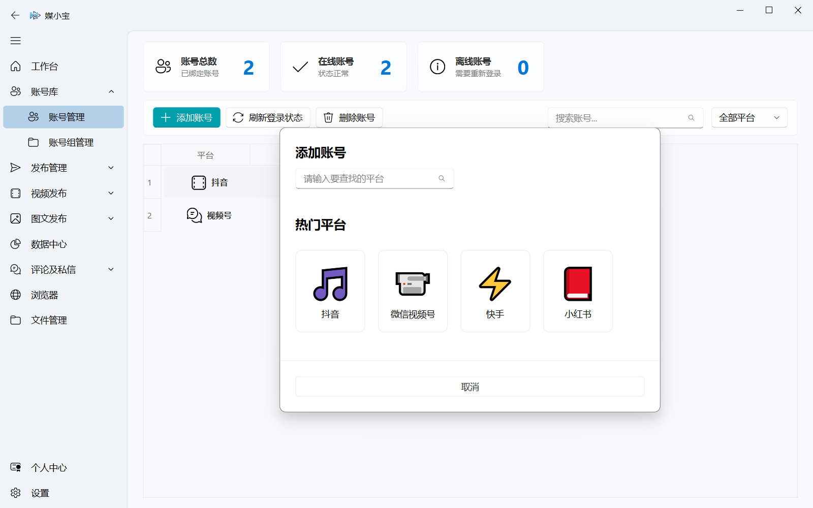
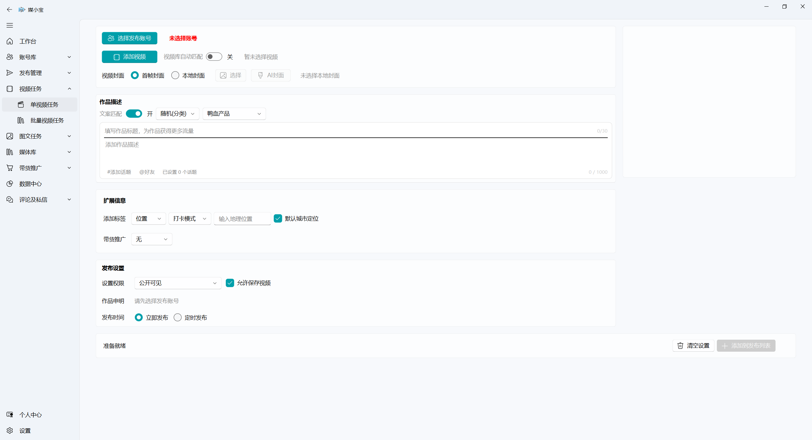
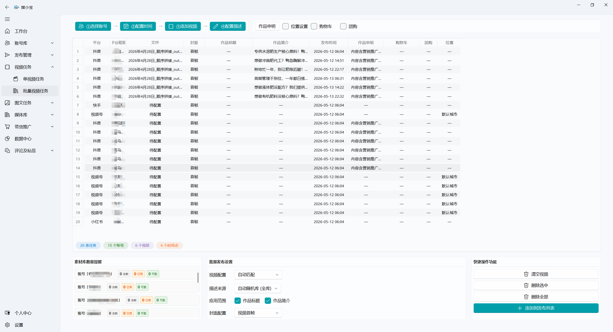
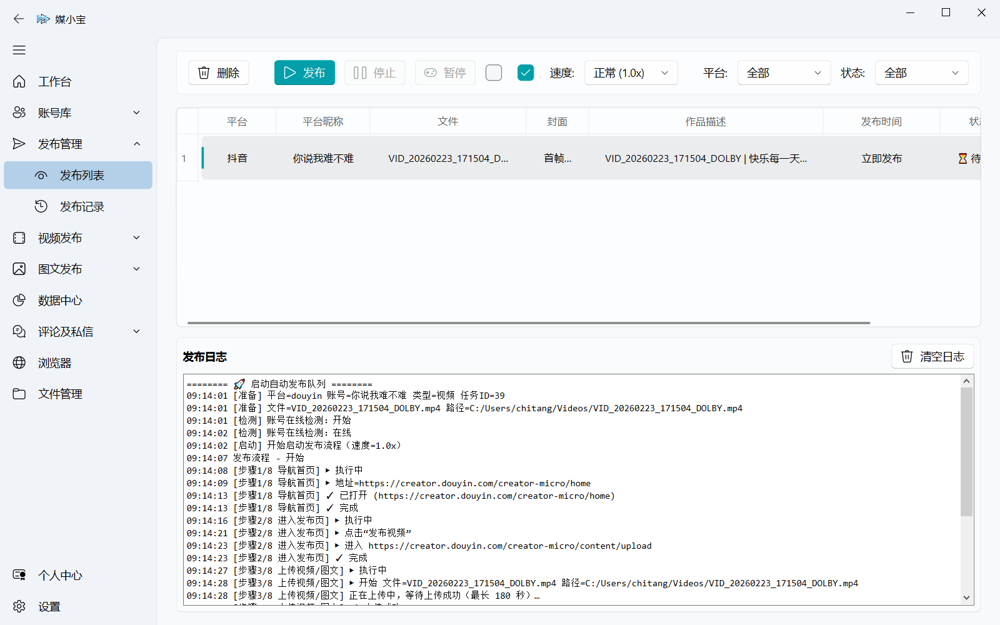
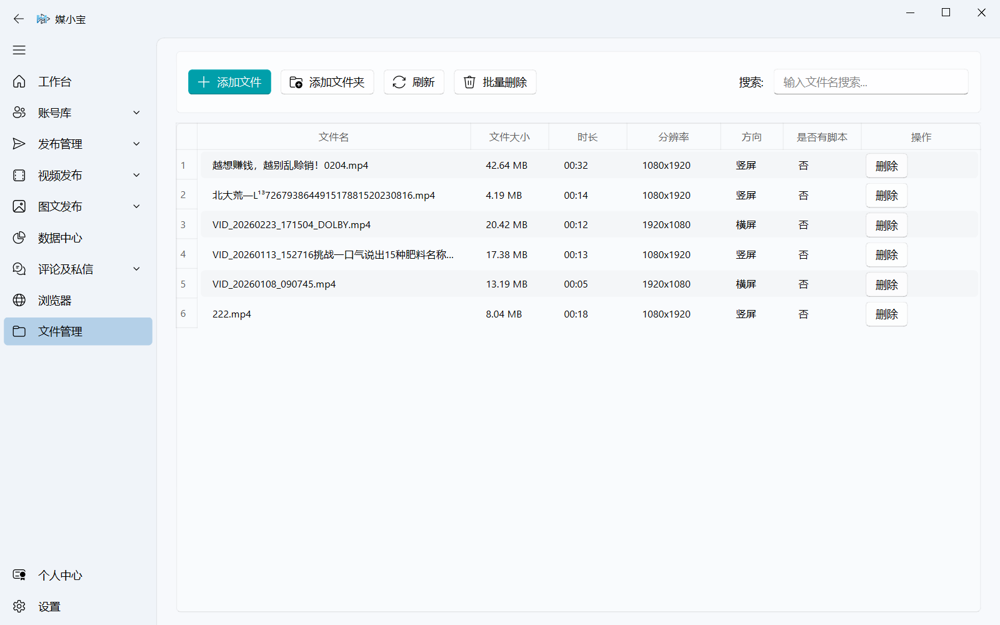

# 媒小宝（WeMediaBaby）

> 还在每天手动发布几十上百条视频？
> 同一个作品要反复分发到多平台、多账号，繁琐又耗时？
> 
> **媒小宝 —— 自媒体矩阵全自动分发工具**
> 专为自媒体创作者、矩阵运营、工作室打造的 Windows 桌面端效率神器。
> 
> 只需一次配置发布任务，
> 底层浏览器自动化技术，模拟真人操作，
> 自动完成：多平台上传、文案填写、定时发布、批量分发。
> 
> 不用频繁切号、不用重复粘贴、不用守在电脑前，
> **让你从重复机械操作里彻底解放，把时间留给内容与变现。**

## 🌟 媒小宝能为你做什么？（开源版体验）

- **一键触达各大平台**：原生支持抖音（Douyin）、快手（Kuaishou）平台账号的安全绑定。
- **化繁为简的发布任务**：创建单条发布任务（视频/图文等按页面提供的入口）。
- **无人值守自动跑批**：发布列表支持一次性执行多条任务，让你的电脑变身全自动分发机器人。
- **免密防封号底座**：先进的账号隔离环境与长效 Cookie 保存机制，极大降低扫码频率。
- **无限可能的二次开发**：提供完整的 UI 渲染引擎、排期列表和执行链路框架，非常适合开发者极速接入新平台！

## 🚀 进阶选择：Pro 商业版专属特权

如果您是专业的自媒体工作室、矩阵玩家或多网域运营者，我们还为您准备了火力全开的 **Pro 商业版本**：

- **十大平台全域覆盖**：重磅解锁视频号、小红书、B站、微博、头条、百家号、企鹅号、多多视频等全网高净值平台，真正实现一站式全网分发！
- **硬核批量并发引擎**：单条发布不过瘾？支持海量视频/图文素材极速批量导入，智能组合生成上百个任务并发排期。
- **全景数据大屏与互动中心**：无需频繁切号查看，内置跨平台大盘数据聚合统计，并可一站式集中管理各大平台的粉丝私信与评论互动。
- **批量与自动化辅助**：独家支持批量任务高速创建、海量素材批量管理，内置强大的随机文案库并支持发布时自动匹配提取，全面提升日常运营效率。

## 它是怎么工作的（3 步）

1. 在任务创建页配置作品信息（标题、封面、素材等）
2. 写入「发布列表」形成待发布队列
3. 在「发布列表」点击发布，浏览器自动化完成平台上传/提交

---

## 📦 版本与边界（开源版 vs Pro/完整版）

OSS vs Pro 功能对比（精简版）

| 功能项                                      | 开源版（OSS/Community） | Pro/完整版（闭源）                                |
| ------------------------------------------- | ----------------------- | ------------------------------------------------- |
| 单条任务创建（视频/图文）                   | ✅                      | ✅                                                |
| 批量创建任务（批量视频/批量图文）           | ❌                      | ✅                                                |
| 发布列表批量执行（批量跑队列）              | ✅                      | ✅                                                |
| 定时发布 / 高级调度 / 断点续传 / 多账号批量 | ❌/受限                 | ✅                                                |
| 平台范围                                    | 抖音、快手              | 抖音 + 快手/小红书/视频号等更多平台（以版本为准） |
| 媒体库                                      | ❌                      | ✅                                                |
| 带货推广 / 数据中心 / 评论私信              | ❌                      | ✅                                                |
| 个人中心 / 登录订阅 / 权限额度              | ❌                      | ✅                                                |
| 交付方式                                    | 源码开源，可自行打包    | 提供编译后的 Windows 安装包（Releases/指定渠道）  |

### Pro/完整版如何提供（重要）

- 开源仓库仅提供 OSS/Community 源码（不包含闭源实现）。
- Pro/完整版通过 **编译后的 Windows 安装包**提供（通常发布在 GitHub/Gitee Releases 或你指定的下载渠道）。
- 安装包命名建议包含构建类型与发行模式，便于区分，例如：
  - `WeMediaBaby_Setup_Fast_OSS_vX.Y.Z.exe`
  - `WeMediaBaby_Setup_Secure_PRO_vX.Y.Z.exe`

## 软件界面

以下截图展示媒小宝主要功能界面（图片位于 `resources/images/`）。

**主界面**



**支持平台**



单视频任务创建页面



**批量视频任务创建**



**发布列表（发布管理）**



**媒体库**



---

## 🌟 核心特性

- **账号与浏览器管理**：Cookie 深度加密保护，降低账号风控风险。
- **发布流水线**：发布列表与各平台 pipeline 执行上传；开源版侧重单条任务与基础能力。
- **智能任务调度**：内置定时任务队列，支持断点续发与发布日志监控。
- **极简现代化 UI**：持续优化的 Fluent Design 交互体验，支持 Windows 11 视觉效果与深色模式。
- **双轨制打包脚本**：Fast（PyInstaller）用于开发/测试；Secure（Nuitka）用于发版（以你本地打包为准）。

---

## 🚀 5分钟快速上手

### 1. 环境准备

- **操作系统**: Windows 10/11 (64位)
- **Python 环境**: Python 3.12 (建议) 或 3.10+
- **浏览器**: 必须安装 **Google Chrome** (用于平台上传与抗指纹检测)
- **必要工具**: 已安装 [Git](https://git-scm.com/)

### 2. 快速安装

**完整安装请执行 `pip install -r requirements.txt`**，以保证运行与测试依赖齐全。若仅执行 `pip install -e .` 可能缺少部分依赖，建议以 `requirements.txt` 为准。

```powershell
# 克隆项目
git clone <repository-url>
cd WeMediaBaby

# 创建并激活虚拟环境 (推荐使用项目内置标准路径 .venv)
python -m venv .venv
.venv\Scripts\activate

# 安装项目依赖（推荐，依赖最全）
pip install -r requirements.txt

# 安装特殊 UI 组件库 (必须通过 git 安装以保证适配性)
pip install git+https://github.com/zhiyiYo/PySide6-Fluent-Widgets.git@PySide6
```

### 3. 初始化并启动

```powershell
# 初始化本地数据库结构
python src/infrastructure/storage/database_init.py

# 以开源版模式运行（建议显式指定，避免本机环境变量/打包残留导致模式不一致）
$env:APP_DIST_MODE="OSS"

# 启动应用程序
python main.py
```

---

## 📂 项目结构规范

以下为**开源仓库（OSS/Community）**的目录结构示例（不包含任何闭源目录与闭源工程）。

```bash
WeMediaBaby/
├── .venv/                  # 项目专属虚拟环境
├── config/                 # 平台配置（插件配置、功能开关等）
├── doc/                    # 开源文档（对外公开、可随开源仓库发布）
├── resources/              # 静态资源 (Icons、StyleSheets、图片)
├── scripts/                # 打包(build)、发版(release)、测试(test)、维护(maintenance)、开发工具(dev)
├── src/                    # 核心 4 层 DDD 架构源代码
│   ├── domain/           # 业务模型与领域事件
│   ├── services/         # 核心业务逻辑服务（开源包装层 + OSS 可运行实现）
│   ├── infrastructure/   # 基础设施层 (DB、Network、Browser、防风控)
│   ├── plugins/          # 平台插件（技术层 + 业务层）
│   ├── ui/               # MVVM 界面实现
│   └── utils/            # 公共工具函数
├── tools/                  # 可选：便携 FFmpeg 解压至 tools/ffmpeg/（设置页会探测）
├── tests/                  # 单元测试
└── main.py                 # 统一入口程序
```

### 根目录文件说明

| 文件                 | 说明                                                                                 |
| -------------------- | ------------------------------------------------------------------------------------ |
| `main.py`          | 应用入口，启动前会将项目根目录加入 `sys.path`                                      |
| `pyproject.toml`   | 项目元数据、依赖声明；**Pyright** 类型检查配置在 `[tool.pyright]`            |
| `requirements.txt` | 完整依赖列表（含开发与测试依赖），**推荐** `pip install -r requirements.txt` |
| `version.json`     | 版本号与更新说明；OTA 与 Gitee 展示以此为准                                          |
| `CHANGELOG.md`     | 变更日志；发版脚本会向顶部追加新版本条目                                             |
| `pytest.ini`       | pytest 配置（测试路径、`markers`、`basetemp` 等）                                |
| `LICENSE`          | 软件许可证（PolyForm 非商业许可；以仓库内 `LICENSE` 为准）                         |

### 常用脚本（不在根目录）

| 路径                                  | 说明                                                                                                                                                                      |
| ------------------------------------- | ------------------------------------------------------------------------------------------------------------------------------------------------------------------------- |
| `scripts/test/run_tests.py`         | 一键运行 pytest，生成 `test-reports/`（HTML + 覆盖率）。等价：`scripts/test/run_tests.bat`（Windows）。兼容入口：`scripts/run_tests.py` / `scripts/run_tests.bat` |
| `scripts/release/version.bat`       | Windows 菜单：按 patch / minor / major 升级版本（写入 `pyproject.toml`、`version.json`、`CHANGELOG`、安装脚本版本号等）                                             |
| `scripts/release/update_version.py` | 同上逻辑的命令行入口，例如 `python scripts/release/update_version.py patch`                                                                                             |

### 启动优化与调试（环境变量）

以下变量读取 **系统环境变量**（或你在启动前注入的环境）；程序启动时**不会**自动加载项目根目录的 `.env` 文件。

| 变量                                 | 说明                                                   | 默认                                    |
| ------------------------------------ | ------------------------------------------------------ | --------------------------------------- |
| `AUTH_API_BASE`                    | 云端认证接口根地址（覆盖内置默认 URL）                 | 见 `src/services/auth/auth_config.py` |
| `ENABLE_STARTUP_PROFILER=1`        | 开启启动耗时埋点                                       | 关闭                                    |
| `PLUGIN_EAGER_INIT=1`              | 启动时全量加载所有平台插件（关闭则按需加载，首屏更快） | 关闭                                    |
| `ENABLE_BROWSER_WARMUP_ON_START=1` | 窗口显示后约 3 秒预热 Playwright                       | 关闭                                    |
| `UI_PAGE_ANIMATION_REDUCED=1`      | 减弱页面切换动画（可选）                               | 关闭                                    |

---

## 🛡️ 技术栈方案

| 组件                 | 技术选型                    | 优势                       |
| :------------------- | :-------------------------- | :------------------------- |
| **GUI 架构**   | PySide6 + Fluent-Widgets    | 商业级视觉效果，LGPL 协议  |
| **异步引擎**   | qasync (asyncio + Qt)       | 解决复杂逻辑下的界面卡死   |
| **浏览器方案** | QWebEngineView + Playwright | 混合动力，兼顾交互与自动化 |
| **存储层**     | SQLite (aiosqlite)          | 轻量、异步、零维护         |
| **代码保护**   | Nuitka (C++ 级编译)         | 防反编译，性能提升         |

---

## 🛠️ 打包指令

我们提供预设的打包脚本，建议使用：

- **快速测试**: `.\scripts\build\build_fast.ps1` (产出至 `dist/fast`)
- **正式发布**: `.\scripts\build\build_nuitka.ps1` (产出至 `dist/secure`)
- **一键清理**: `.\scripts\maintenance\clean_project.ps1` (删除 build/dist/缓存，方便备份)

---

**特别说明**：版本号与更新文案以仓库根目录 **`version.json`** 为准；用户端「检查更新」对比的是 **Gitee 上同路径的 `version.json`**。如有疑问，可通过项目主页或仓库 Issue 反馈。

---

## 📖 开源文档入口（只引用 `doc/`）

- `doc/媒小宝项目介绍文档（超详细版）.md`：对外可读的整体介绍
- `doc/1.1技术文档.md`：工程结构、关键模块说明等
