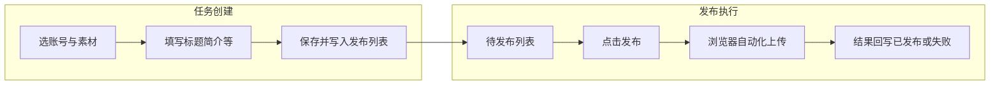

# 媒小宝（WeMediaBaby）项目功能介绍（超详细版）

| 项目 | 内容 |
|------|------|
| **文档名称** | 媒小宝项目功能介绍（面向产品与投喂 AI） |
| **文档版本** | v1.0.0 |
| **最后更新** | 2026-04-10 |
| **对应软件版本** | 以仓库根目录 `version.json` 为准（编写时为 1.2.0） |

---

## 一、文档说明与使用方式

### 1.1 本文用途

本文面向：**产品经理、运营、内容编辑**，以及需要把「软件能做什么、怎么用」讲清楚的场景。你可以将**整篇或分章节**复制给大模型，用于生成：

- 公众号「软件介绍 / 卖点梳理 / 功能清单」类文章；
- 公众号「分步骤使用教程 / 新手指南 / FAQ」类文章。

### 1.2 投喂 AI 时的建议

- 明确告诉模型：**目标读者**（完全新手 / 运营老手）、**文章长度**、**语气**（正式 / 轻松）、**是否需要配图占位**。
- 要求模型在成文中保留**合规提示**：各平台规则可能变更；请遵守平台服务条款；自动化操作存在风控与封号风险，需用户自行判断。
- 技术实现细节（类名、文件路径）本文刻意压缩；需要架构级说明可另参 `docs/01总文档/1.1技术文档.md`。

### 1.3 信息优先级（若与其它文档冲突）

以如下顺序为准：**根目录 `README.md`** → **`config/feature_flags.py`（特性开关）** → **实际安装包界面** → 其它分文档。原因：部分历史文档可能未随版本同步。

---

## 二、产品一句话与适用人群

**媒小宝**是一款 **Windows 桌面端**的自媒体辅助工具：在本地管理多平台账号与素材，通过内嵌浏览器自动化能力，将视频/图文内容按任务写入**发布列表**，再在列表中统一或排队执行**真实网页端上传**。

- **适合**：多账号运营、批量排期、希望减少重复填表与切网页的工作室或个人创作者。
- **不适合**：期望「完全云端、无需本机浏览器」的纯 SaaS 场景；或对单一平台只做偶尔一次发布、不愿安装维护本地环境的用户。

---

## 三、版本、许可与权益（重要）

### 3.1 Community Edition（社区版）与 Pro Edition（专业版）

与根目录 **README** 一致，概要如下：

| 维度 | Community Edition | Pro Edition |
|------|-------------------|-------------|
| **许可** | AGPLv3 开源范围 | 商业许可 |
| **典型能力** | 抖音单视频任务创建与执行、账号管理、基础 UI、媒体库、浏览器管理 | 批量任务创建、多平台发布列表执行、定时发布、高级调度等（见 README 列表） |

**特性开关源码**（`config/feature_flags.py`）中约定：

- **开源版默认可用能力**包括：抖音账号登录、抖音单视频发布、基础 UI、浏览器管理。
- **标记为 Pro 的能力**包括：批量发布、定时发布、快手/小红书/视频号等平台开关、用户认证与订阅相关、高级调度、断点续传、多账号批量等（具体以该文件为准）。

**说明**：源码中还实现了更多平台插件（见下文「平台能力」）；**是否在你的安装包中可选、是否需会员**，以**软件内实际可选平台与登录权益**为准，勿仅凭文档臆测。

### 3.2 与「软件账号 / 会员」的关系

若产品启用了云端账号体系，通常包含：注册登录、会员等级（如 vip0 / vip1）、到期时间、额度（可登录账号数、分组数、每日发布上限等）。用户侧的感知是：**未登录或额度不足时，部分按钮不可用或发布前被服务端校验拦截**。

详细字段与流程见：`docs/05软件账号体系及商业化介绍/4.1软件账号体系介绍.md`（本文不展开接口与字段表）。

### 3.3 第三方界面组件许可（分发软件者必读）

界面使用 **QFluentWidgets（PySide6-Fluent-Widgets）**。若你**商用分发**或**闭源打包**，需自行确认已满足该组件作者对 **GPL/商业许可** 的要求（README 中有官方链接说明）。本文读者若仅使用软件、不写代码，可忽略本条。

---

## 四、运行环境与依赖

- **操作系统**：Windows 10/11（64 位）（与 README 一致）。
- **本机浏览器**：须安装 **Google Chrome**（用于平台上传与指纹相关能力）。
- **从源码运行**：Python 3.12（建议）或 3.10+；依赖以 `requirements.txt` 为准；需执行数据库初始化与 `main.py` 启动（见 README）。
- **网络**：账号登录、发布、部分校验与更新检测需要可用网络。

---

## 五、核心主路径：内容如何真正发出去

### 5.1 用户必须理解的一句话

在「单视频 / 单图文 / 批量（若可用）」等页面**配置任务并写入发布列表**后，任务进入 **发布管理 → 待发布**；用户在该页发起「发布」后，软件才驱动浏览器在各平台**执行实际上传**。  
**不是在任务创建页点保存就立刻发到网上。**

### 5.2 最短用户故事

1. 在 **账号库** 中为抖音（或其它可用平台）完成登录与昵称展示。  
2. 在 **单视频任务**（或批量页，若已启用）里选好素材、标题简介等，保存并**加入发布列表**。  
3. 打开 **发布管理 → 待发布**，选中任务，按界面提示执行发布；观察日志直至成功或失败。  
4. 在 **已发布** 中查阅记录；必要时在 **任务回收站** 处理误删。

### 5.3 流程示意（概念）



---

## 六、主导航功能地图（与侧栏一致）

下列结构来自 **`src/ui/navigation_config.py`**。其中 **带「若可用」** 的项依赖安装包是否包含对应 `pro_features` 模块（主窗口会探测能否导入）。

| 一级 | 二级 / 说明 |
|------|-------------|
| **工作台** | 数据概览、快捷入口、最近活动、图表等 |
| **账号库** | **账号管理**、**账号组管理** |
| **发布管理** | **待发布**、**已发布**、**任务回收站** |
| **视频任务** | **单视频任务**；**批量视频任务**（若可用） |
| **图文任务** | **单图文任务**；**批量图文任务**（若可用） |
| **媒体库** | **视频库**、**图片库**、**文案库** |
| **带货推广** | **购物车推广**、**团购推广** |
| **数据中心** | 若可用：数据看板类页面 |
| **评论及私信** | 若可用：评论管理、私信管理 |
| **个人中心** | 若可用：与账号/订阅相关 |
| **设置** | 全局选项、媒体库路径、浏览器方案等 |

**侧栏未出现某菜单时**：通常表示当前构建未打入该模块，或权益未开通，**属正常现象**，不必强行对照全文逐条找入口。

---

## 七、分模块功能说明（面向使用者）

以下每节采用统一结构：**解决什么问题 → 界面与要点 → 典型操作 → 与其它模块的关系**。

### 7.1 工作台

- **解决什么问题**：一屏查看账号与发布概况，并快速跳转到高频页面。
- **界面与要点**：统计卡片（账号数、今日发布、队列与成功率等）、快捷操作（如添加账号、进入发布列表、创建单条/批量任务）、公告、最近活动、平台分布与趋势图等；首页可能定时刷新数据。
- **典型操作**：从快捷入口进入账号管理或任务创建页。
- **关系**：数据依赖本地库与当前工作区；图表与列表为只读总览，真正操作在对应功能页完成。

（细化描述可参考 `docs/02各页面功能介绍/2.1工作台/2.1工作台.md`。）

### 7.2 账号库 — 账号管理

- **解决什么问题**：维护各平台已绑定账号、在线状态与基础操作入口。
- **界面与要点**：统计卡片、按平台筛选、关键词搜索、表格列（平台、昵称、登录状态、最后登录时间、操作等）。
- **典型操作**：**添加账号**（在弹出浏览器中完成平台登录后，自动提取 Cookie 与昵称）、刷新列表、更新 Cookie、删除等。**浏览器方案**可在设置中选择「纯净（Undetected Playwright，推荐）」或「混合（内置 WebEngine）」——风控敏感时优先纯净方案。
- **关系**：发布任务创建时的账号下拉数据来源于此处；媒体库「账号库」子目录命名与账号、账号组联动。

（可参考 `docs/02各页面功能介绍/2.2账号库/2.2账号管理.md`、`2.1账号库.md`。）

### 7.3 账号库 — 账号组管理

- **解决什么问题**：把多个账号归为一组，便于批量任务按组选择、按组归档素材。
- **典型操作**：创建组、添加/移除成员、组与组之间互斥或包含关系以界面为准。
- **关系**：批量预览与发布任务数量与「是否账号组、组内成员数」强相关（见「批量逻辑」一节）。

### 7.4 发布管理 — 待发布 / 已发布 / 回收站

- **待发布**：展示已写入队列、尚未执行或等待执行的任务；在此发起**发布**、调整队列相关设置（如发布间隔、部分全局策略）。
- **已发布**：历史记录与状态查询。
- **任务回收站**：误删任务的恢复或清理（具体以界面为准）。

**发布设置（重要）**：在待发布相关工具栏中可配置例如 **发布后本地文件处理**（不处理 / 移动到媒体库「已发布」目录 / 删除源文件等）。仅当**发布成功**时才会触发文件后置逻辑；失败不移动文件。详细规则见 `docs/02各页面功能介绍/2.4视频发布/2.4.6发布后文件操作功能说明.md`。

**队列节奏（概念）**：自动队列可在任务之间按设定间隔加入随机等待，降低连续操作带来的风险（具体数值以设置与版本为准）。

### 7.5 视频任务 — 单视频

- **解决什么问题**：为一个账号配置一条视频发布任务（标题、简介、封面、挂载商品或位置等，以当前平台插件支持为准），写入发布列表。

### 7.6 视频任务 — 批量视频（Pro 构建中可用时）

- **解决什么问题**：多账号、多视频、多时间点排期，减少重复配置。
- **结构**：多为「左侧配置 + 右侧预览」；需按引导完成：**选择账号 → 配置发布时间排期 → 添加视频**（顺序有依赖，未完成前后续按钮可能禁用）。
- **批量要点**：批量视频任务界面通常**仅支持定时发布**，不提供「立即发布」；预览行数与「时间槽」有关，而写入发布列表的条数与「账号组是否展开为多成员」有关（详见下一节）。

（界面级说明可参考 `docs/02各页面功能介绍/2.4视频发布/2.4.1批量视频页面功能介绍.md`。）

### 7.7 图文任务 — 单图文 / 批量图文

- **解决什么问题**：图文类内容的创建与入库逻辑与视频类似；批量能力在 Pro 构建中提供时，用于多图文的规则化生成与排期。

### 7.8 媒体库（视频库 / 图片库 / 文案库）

- **解决什么问题**：把素材与文案结构化，供单条或批量任务引用。
- **要点**：  
  - **文案库**：条目在本地数据库维护，可 Excel 导入；支持作品编号规则，便于与视频文件名**自动匹配**文案。  
  - **视频库 / 图片库**：映射磁盘目录；与 **设置 → 媒体库配置** 中的根路径强相关；目录下默认包含 **`媒小宝媒体库`**，其下有 **视频库、图片库、账号库** 等，账号目录下分 **视频/图文** 与 **已发布/未发布**。  
  - 未配置媒体库路径时，进入相关页会提示先去设置。

（细节见 `docs/02各页面功能介绍/2.5媒体库/2.5.1媒体库功能介绍.md`。）

### 7.9 带货推广（购物车 / 团购）

- **解决什么问题**：在符合平台规则前提下，为内容挂载带货、团购相关信息（具体字段与平台能力以插件与界面为准）。

### 7.10 数据中心、评论及私信、个人中心

- **若侧栏存在**：分别为数据统计、互动管理、账户/会员相关入口。  
- **若不存在**：当前安装包未包含或未启用，不必在对外宣传中承诺。

### 7.11 设置

- **典型项**：主题、语言或字体（若有）、**媒体库根路径**、**浏览器方案**、更新检查、以及与发布相关的默认偏好等。

---

## 八、横切通用能力（跨页面）

以下内容提炼自 `docs/01总文档/1.7项目中通用模块介绍.md`，便于 AI 生成「深度功能稿」时不漏项。

| 能力 | 用户可感知价值 |
|------|----------------|
| **作品简介与话题（`#话题`）** | 在简介中写话题标签，解析规则在单条与批量之间一致，避免「同一文案数出不同话题」。 |
| **配置中心与路径管理** | 统一保存用户偏好；安装目录与可写数据目录分离，升级软件时少踩路径坑。 |
| **发布流水线** | 后台把一次发布拆成多阶段，便于扩展校验与日志；用户侧主要感知为「步骤日志与结果状态」。 |
| **事件通知** | 发布开始、结束、失败等可在界面提示或刷新列表。 |
| **批量预览与发布任务规则** | 预览行数、账号组展开为多条真实任务等，见下一节。 |
| **发布后本地文件** | 成功发布后可自动归档或删除源文件，保持文件夹清爽。 |

---

## 九、批量任务：预览行与发布条数（摘要）

详细规则见 `docs/01总文档/1.6批量视频（批量图文）预览及发布任务生成逻辑.md`。以下为投喂 AI 用的**最短正确摘要**：

- **预览任务**：批量页表格里展示的行；数量主要由**时间槽**与**所选账号数量**决定，与账号组内有多少成员**无直接一一对应**（组在预览层往往仍为一行逻辑）。  
- **发布任务**：点击「添加到发布列表」后写入待发布的条数；若选择 **账号组**，通常按 **组内成员数 × 预览任务数** 展开为多条真实账号任务。  
- **标准三步**：①选择账号 → ②配置发布时间排期 → ③添加视频；②未完成则③不可用。  
- **批量视频页**：以**定时发布**为主流程，**无「立即发布」**（与文档一致）。

---

## 十、平台能力矩阵（源码视角 + 产品表述建议）

### 10.1 源码中的发布插件（当前仓库）

下列平台在 `src/plugins/**/publish_plugin.py` 中存在实现（**不代表**你的安装包已全部开放）：

- **社区目录**：抖音（`douyin`）、快手（`kuaishou`）  
- **专业目录**：微信视频号（`wechat_video`）、小红书（`xiaohongshu`）、B 站（`bilibili`）、微博（`weibo`）、头条（`toutiao`）、百家号（`baijiahao`）、多多视频（`duoduoshipin`）、企鹅号（`qiehao`）

### 10.2 权限校验的两套线索（写给内部与 AI）

- `config/feature_flags.py` 中 **`OPEN_SOURCE_PLATFORMS`** 当前为 **`douyin`**；**`PRO_PLATFORMS`** 含 **`kuaishou`、`xiaohongshu`、`wechat_video`**。  
- `src/utils/pro_platforms.py` 中 **`PRO_PLATFORM_IDS`** 列出另一批需 Pro 的平台 ID（含 B 站、微博等，**不含快手**）。  

**对外话术建议**：以 **README** 为准——开源版突出 **抖音**；专业版强调 **批量、多平台、定时、调度** 等能力。具体「可选平台列表」以**软件界面**为准，避免列举与版本不一致的平台名。

---

## 十一、数据存储与隐私（用户可读）

- **账号为中心**：各账号的 Cookie、浏览器用户数据、指纹配置等落在本地数据目录，便于备份与隔离。  
- **Windows 数据根**：常见为 `%LOCALAPPDATA%\WeMediaBaby\`（详见 `docs/01总文档/1.2数据目录结构说明.md`）。  
- **Cookie 文件**：业务上常以明文 JSON 形式存在于账号目录下，**请妥善保管整机与磁盘**，避免被他人复制。  
- **合规**：本文档不鼓励任何违反平台服务条款的用途；用户应自行阅读各平台规则。

---

## 十二、术语表

| 术语 | 解释 |
|------|------|
| **任务** | 一次拟发布内容及其元数据（标题、简介、素材路径等）在软件中的记录。 |
| **发布列表 / 待发布** | 已创建、等待执行发布动作的任务队列所在视图。 |
| **工作区** | 逻辑上隔离的一组数据与配置，切换工作区可避免多业务线数据混淆（若产品启用）。 |
| **账号组** | 多个账号的逻辑集合，用于批量选择与素材归档。 |
| **时间槽** | 批量排期中每一个计划发布的时间点；预览行数常与之相关。 |
| **纯净 / 混合 浏览器方案** | 外置 Chrome 自动化 vs 内嵌浏览器组件，前者更适合抗风控。 |
| **Pipeline（流水线）** | 发布过程在程序内部被拆成多阶段执行，便于日志与扩展。 |

---

## 附录 A：投喂 AI 的提示词模板（可直接复制修改）

### A.1 生成「软件介绍」公众号文章

```text
你是一位熟悉自媒体工具的中文作者。请根据我提供的《媒小宝》功能介绍文档，写一篇面向新用户的公众号文章（约 2000 字以内），结构包含：开头故事感引入、核心痛点、三大卖点、适合谁 / 不适合谁、版本差异（Community vs Pro 用通俗话说明）、合规与风险提示、结尾简明行动建议（下载 / 试用步骤从文档摘）。要求：不要编造文档未提及的功能；涉及平台名称以文档为准；语气亲切但专业。
```

### A.2 生成「从安装到第一次发布」教程

```text
你是一位写教程的技术编辑。请根据文档写一篇「零基础」分步教程：从环境准备（Windows、Chrome）、账号登录、创建单视频任务、到发布列表里点发布、查看已发布与失败处理。每一步用「用户看到什么 → 点哪里 → 预期结果」格式。若文档注明某功能为 Pro 或可能不可用，要在该步骤加一句说明。不要出现源码文件名；最后加「常见问题 5 条」。
```

### A.3 生成「批量排期与媒体库」进阶教程

```text
请结合文档中「批量三步」「预览与发布任务数量关系」「媒体库目录结构」三节，写一篇给运营人员的进阶教程。重点解释：为什么选了账号组后发布条数会变多、批量页为何以定时为主、文案库与视频文件名自动匹配能省什么事。文中用一个小例子（2 个时间槽、1 个 3 人账号组）帮助理解数量。避免术语堆砌。
```

### A.4 生成「FAQ / 排错」清单

```text
根据文档整理 15 条 FAQ，覆盖：发布列表与任务创建区别、批量按钮灰色、媒体库未配置、浏览器方案选择、发布后文件被移动、Community 与 Pro 边界。每条答案不超过 120 字，并注明「若界面与文档不一致以软件为准」。
```

---

## 附录 B：文档维护说明

改版时请同步核对：

1. 根目录 **README.md** 中的版本能力与流程描述；  
2. **`config/feature_flags.py`** 中的 Community / Pro 集合；  
3. **`src/ui/navigation_config.py`** 侧栏是否新增/重命名页面；  
4. **`version.json`** 中的版本号与日期；  
5. 对外承诺前，在**真实安装包**上点一遍主路径。

---

**文档结束**
