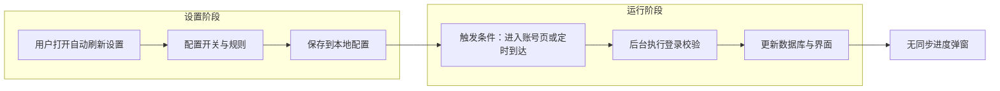

# 自动刷新登录状态功能

| 项目 | 内容 |
|------|------|
| **文档名称** | 自动刷新登录状态功能 |
| **文档版本** | v0.1.0（待随功能发布同步更新） |
| **最后更新时间** | 2026-04-10 |
| **更新时软件版本** | 待发布（功能上线后请与本行与「文档版本」一并更新） |

**文档简介**：本文档说明账号管理页「自动刷新登录状态」的产品行为、设置项与静默刷新规则，供产品、测试与用户查阅。改版时请同步更新页首元信息。

**适用模块**：账号管理（Account Management）

---

## 1. 背景与目标

部分平台（例如微信视频号）登录态容易因 Cookie 失效、服务端会话过期等原因掉线；若仅依赖用户**手动**点击「刷新登录状态」，列表中的在线/离线状态可能长时间滞后，影响排期发布等操作前的判断。

本功能在账号管理页提供**自动刷新登录状态**能力：在后台按规则发起与手动刷新相同的登录校验，但以**静默**方式更新结果，不打断当前操作。

---

## 2. 功能概述

### 2.1 入口位置

在**账号管理**页面顶部操作栏中，于 **「删除账号」按钮右侧** 增加 **「自动刷新设置」** 按钮。

用户点击该按钮后，打开 **「自动刷新登录状态」** 设置弹窗，用于配置是否启用自动刷新及具体规则。

> **说明**：自动刷新执行过程中**不**再弹出额外业务弹窗；设置弹窗仅在用户主动打开「自动刷新设置」时出现。

### 2.2 与手动刷新的关系

- **手动「刷新登录状态」**保留不变，适合用户需要**立即、全量**同步并看到明确进度与结果提示的场景。
- **自动刷新**作为补充：在设定时机后台校验，**不**替代手动刷新的交互，二者可同时存在。

---

## 3. 设置弹窗说明

### 3.1 总开关

- **启用自动刷新**：打开后，下方「进入页面后自动刷新」「定时刷新」等子选项方可生效（具体以界面勾选状态为准）。
- **关闭**：关闭后，所有自动刷新行为停止，直至用户再次开启。

### 3.2 进入页面后自动刷新

- 勾选后：当用户**进入或切换到账号管理页面**时，在后台触发**一次**登录状态校验（触发细则可由实现定义为「每次页面显示」或「本次软件运行内首次进入」等，以发布说明为准）。
- 用于用户频繁进出账号页时，尽量在可见时同步最新状态，而无需每次手动点「刷新登录状态」。

### 3.3 定时自动刷新

- 勾选后：按用户配置的 **间隔（小时）** 周期性执行登录状态校验（例如每隔 1、2、3… 小时；具体可选档位以软件界面为准）。
- 与「进入页面后自动刷新」可同时启用，二者互不排斥（实现上应避免同一时刻重复全量校验，可做合并或防抖，属实现细节）。

### 3.4 作用范围

- 自动刷新对**账号库中的账号**执行与**手动点击「刷新登录状态」**相同的登录校验逻辑（全量账号；与当前手动全量刷新行为一致，便于理解请求规模）。
- 校验通过后，更新各账号在列表中的 **「登录状态」**（在线/离线等）及顶部统计卡片中的在线、离线数量；单行若有离线原因展示，与现有表格行为保持一致。

### 3.5 配置保存

- 用户在弹窗内点击**确定/保存**后，设置写入本地配置，**关闭软件后仍然保留**（具体存储位置由实现决定，用户无需关心）。

---

## 4. 静默刷新说明

「静默刷新」指：**自动触发**的登录状态校验在交互上与「手动刷新」区分，**不**采用整页进度条与批量完成后的强提示，仅通过列表与统计数字的变化体现结果。

### 4.1 与手动刷新行为对照

| 对比项 | 手动「刷新登录状态」 | 自动刷新（静默） |
|--------|----------------------|------------------|
| 触发方式 | 用户点击按钮 | 进入账号页 / 定时器（依设置） |
| 进度弹窗 | 显示「同步账号状态」等进度窗口 | **不显示**该类整页进度弹窗 |
| 完成提示 | 通常有顶部提示条（如验证完成汇总） | **不显示**与批量完成相关的成功类提示；**仅**更新列表与统计 |
| 校验机制 | HTTP 插件校验登录态（与各平台一致） | **相同**校验机制，见下文「相关文档」 |
| 列表更新 | 更新登录状态列与统计 | **相同** |

### 4.2 用户可见的变化

- **会出现**：账号列表「登录状态」列、顶部「在线账号 / 离线账号」等统计随校验结果更新。
- **不出现**：自动刷新流程中的同步进度条、批量验证结束后的成功类 InfoBar（避免打扰）。

---

## 5. 典型使用场景

1. **视频号等平台易掉线**：开启「定时自动刷新」后，每隔若干小时静默校验一次，便于尽早将列表中的状态更新为离线，减少「列表仍显示在线、实际发布失败」的落差。
2. **频繁查看账号管理页**：开启「进入页面后自动刷新」，每次进入页面即触发一次后台校验，减少忘记手动刷新的情况。

---

## 6. 限制与注意事项

1. **网络与频率**：自动刷新会向各平台发起校验请求。请勿将定时间隔设置过短，以免增加无效请求与平台风控风险；建议按实际业务需要选择合理小时数。
2. **定时任务生效范围**：定时刷新一般在**账号管理页面已打开且软件运行期间**生效；**关闭软件后不会继续在后台执行**定时校验。若长时间停留在其他页面，是否仍计时以实际发布版本说明为准（若仅在账号页内计时，文档与产品提示应一致）。
3. **不能替代重新登录**：校验结果为离线时，用户仍需按平台要求重新登录或更新 Cookie；自动刷新只更新**状态展示**，不自动完成登录操作。
4. **与手动刷新并存**：需要立即确认全量结果时，仍应使用「刷新登录状态」以获得明确的进度与完成反馈。

---

## 7. 流程示意

---

## 8. 相关文档

- 登录状态校验原理、HTTP 验证流程与各平台扩展说明，参见同目录下的 [账号列表刷新功能实现原理](2.4账号列表刷新功能实现原理.md)。**自动刷新与手动刷新在校验机制上保持一致，差异主要在触发时机与用户交互（静默与否）。**
