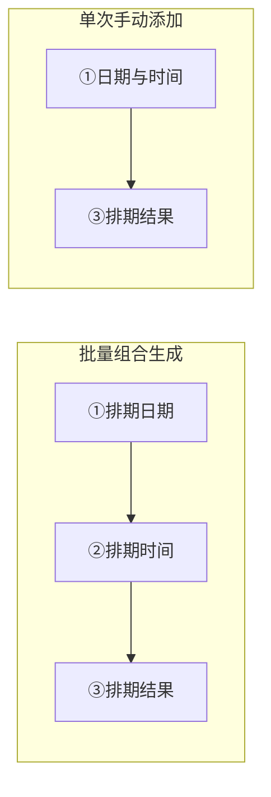

# 发布时间排期：计算规则与使用说明

本文说明批量视频任务里「设置发布时间排期」弹窗的用法，以及程序如何把您的设置变成右侧列表里的具体日期时间。**规则与当前软件代码一致**；多天展开与时间窗的底层计算在程序内部模块中实现（与界面逻辑配套，请勿与旧版文档里「随机轴末档固定 23:30」等过时描述混淆——当前随机分钟轴的区间终点以您在界面里设置的**结束时间**为准）。

---

## 1. 这个弹窗是做什么的

- 只用于**定时发布**：设置每一条任务大概在什么时间发。软件里**没有**「立即发布」选项。
- 顶部有两个页签：
  - **批量组合生成**：按「开始日期、发几天、每天几个点」等规则，自动生成一整张排期表。
  - **单次手动添加**：自己选一个日期和时间，一条条加到右侧列表。

三个区域在说明里称为 **① 排期日期**、**② 排期时间**、**③ 排期结果**（批量页签下三块；单次页签下①在左侧，③在右侧，中间②在批量页签下才会出现）。

---

## 2. 平台允许的定时范围（两种页签都一样）

各平台对「定时发布」通常要求：**不能太近，也不能太远**。本软件按统一规则校验（与内部常量一致）：

| 规则 | 含义 |
|------|------|
| **最早** | 必须不早于**当前这一刻往后数 2.5 小时**（程序里为 9000 秒）。 |
| **最晚** | 必须不晚于**当前这一刻往后第 15 个自然日**内的同一时刻（按程序日期运算，不是简单理解为「第 15 天 23:59」）。 |

**单次手动添加**页签下，若您选的日期时间太早，软件会自动改到「满足最早规则之后，再略往后一点」的近似时间，并提示「定时发布必须至少设置在 2.5 小时以后」。若选得太晚，会把日期拉回到允许范围内的最后一天并提示。

**批量组合生成**里，某一天某一档算出来的时刻如果落在这个窗口外，**这一档会被直接丢掉**，总条数可能变少（见下文「未满提示」）。

---

## 3. 页签一：批量组合生成

### 3.1 ① 排期日期里都有什么

- **开始日期**：从哪一天开始排。打开弹窗时默认一般是**明天**（以软件打开时的「今天」为准）。
- **发布天数**：连续发多少天。可选 **1～14 天**；默认一般是 **2 天**（以界面默认选项为准）。
- **每日次数**：每天打算排几个时间点。
  - 下拉里有 **1～6** 的快捷项。
  - 也可以**手动输入数字**，合法范围为 **1～99**（程序会取您输入里**第一个整数**来判断是否在范围内）。
  - 输入合法后，会按下面的「开始时间～结束时间」和「分钟模式」自动生成 **② 排期时间**里的多行模板。
- **开始时间 / 结束时间**：用来界定「每天在什么时间段里均匀插点」。默认常见为 **06:00～22:00**（以界面为准）。
- **分钟模式**：
  - **整点**：生成的时间都是 **HH:00**（整点）。
  - **随机分钟**（默认）：② 里显示为 **某点:随机**，表示真正发出去的时刻会在**该小时内的 0～59 分**里由程序随机选（还要满足上面的平台时间窗，见第 5 节）。

### 3.2 ② 排期时间：模板从哪来、能改什么

- 改「每日次数」或开始/结束时间、切换整点/随机，都会**重新生成**②里的行（会覆盖之前由快捷生成出来的模板；**不会**从③反推）。
- 在 **②** 标题栏的时间选择器里选好时间后，在弹出面板里**点对号确认**，可以**再增加一行**时间。这样加出来的行，在「随机分钟」模式下会按**固定时分**参与排期，**不会**再在该小时内随机（软件里把这种行当作「自定义」行）。**随机分钟模式下，这类行在表格里会直接显示为具体时分（如 `08:00`），不会显示成「08:随机」。**
- 可以**双击**某行时间修改、点**移除**删掉该行；点 **清空** 会清空整个时间池，并清空「每日次数」输入框。
- ② 里**同一时刻不能重复**；重复会提示并恢复。

### 3.3 ③ 排期结果：和①②的关系

- 右侧列表每一条格式为：**年-月-日 时:分**（没有秒），例如 `2026-04-12 08:30`。
- 在**批量**页签下，③ 是程序根据①的开始日期、发布天数和②的每一行模板**自动算出来**的。
- 您在③里点某条的 **移除**：会从当前列表里删掉这一条。若之后又去改了①或②（或任何会触发重新计算的操作），列表会**按规则整体重算**，那时被删掉的那条**有可能再次出现**——若您想长期少发几条，需要改②里的模板数量或调整日期范围，而不是只删③。
- ③ 为空时，点「确定」会提示先添加至少一条发布时间。

---

## 4. 「每日次数」怎样变成②里的具体时间点（等分规则）

程序内部允许一天最多 **288** 档；界面上手输超过 **99** 的数字不会被接受，因此在正常使用下您不会超过 99 档，也落在 288 以内。

### 4.1 随机分钟模式（未选「整点」时）

- 在**当天**从 **开始时间的时、分** 到 **结束时间的时、分** 之间，按**分钟数**拉成一条线段。
- **每日次数**记为 m：
  - **只有 1 档**时：锚点取开始、结束分钟中较小的一个（开始时间不晚于结束时，即**开始时刻**）。
  - **多档**时：**第一档靠近开始**，**最后一档固定落在结束时刻**；中间各档在这条分钟线段上**按比例四舍五入**取整分钟，并限制在不超出开始～结束之间。
- **重要**：结束时刻不是写死的 23:30，而是**您在「结束时间」里选的值**（默认若界面是 22:00，则线段终点就是 22:00）。

若开始时间晚于结束时间，会提示排期无效并清空模板。

### 4.2 整点模式

- 只在**整点小时**上插点：
  - 起点小时 = **开始时间的小时**（开始时间里的「分」**不参与**整点轴起点）。
  - 终点小时 = **结束时间的小时**与 **23** 中较小的一个；结束时间里的「分」在整点规则下**不参与**计算。
- 若从起点小时到终点小时（含两端）的**整点个数**少于您要的每日次数，或只有一个整点却要多个档，会提示「整点档位数不足」之类信息并清空模板。

---

## 5. 从②到③：多天怎么展开、随机怎么选

前提：**开始日期**为第 1 天，之后连续 **发布天数** 天；每一天都会对②里**每一行模板**尝试生成一条**具体的年-月-日 时:分**。

- 程序会按模板时间字符串**排序后**依次处理（顺序稳定，便于理解成「按时间先后处理」）。
- **整点模式**，或 **随机分钟模式下的「自定义」行**：用模板上的**时、分**直接拼到那一天。若超出第 2 节的时间窗则**不要**；若与已经排好的**另一条完全同一时刻**则**跳过**（全表不允许重复时刻）。
- **随机分钟模式下的非自定义行**（界面显示 **HH:随机**）：
  - 只认模板里的**小时**；
  - 在该小时从 **:00** 到 **:59** 的分钟里，先去掉不满足平台时间窗的分钟，再在剩余分钟里**随机打乱顺序**，挑第一个还没被占用的分钟；若这一小时里**没有可用分钟**或**全被占用**，这一天这一档就**没有**（会表现为总条数变少、单日条数少于②的行数）。

每次刷新批量结果时，程序会重新用**新的随机数**；因此**随机分钟模式下，只要触发重算，具体分钟可能和上一次不一样**。

### 5.1 为什么有时会提示「排期未满」

- 软件心里有个期望：**② 里有多少行模板 × 发布天数**，就理想情况下应有多少条。
- 若实际③里更少，可能是因为：某些天某些档落在平台时间窗外被裁掉、随机时与别的档抢同一分钟、或某小时内没有合法分钟等。
- 此时可能出现提示，大意是：定时须在至少 2.5 小时之后且不超过 15 天，部分日期没能排满与②一致的条数，并可能列出**哪一天少了几条**。

---

## 6. 页签二：单次手动添加

- 在左侧选好**日期**和**时间**，点 **添加排期**。
- 必须满足第 2 节的时间窗；否则会提示不合规。
- 与已有列表里**完全相同的时刻**不会重复添加。
- 添加成功后，为方便连续添加多条，软件会把选择器**自动往后推大约 3 小时**（若仍在 15 天限制内）。

单次页签与批量共用右侧 **③ 排期结果**；切换到单次时，中间的 **② 排期时间**和底部三色汇总条会隐藏，但③里的数据仍在（两种页签共用同一份结果列表）。

打开弹窗时，单次页签里日期/时间的**初始值**通常设在「略晚于最早允许定时」附近（便于一上来就合法），具体以界面显示为准。

---

## 7. 底部三个汇总标签怎么读

仅在 **批量组合生成** 页签下会看到底部三个圆角标签（单次页签下会隐藏）。

- **排期 X 天**：当前③里出现了**多少个不同的日期**。
- **每日 N 次（配置）**：表示 **② 排期时间表格里当前有多少行**（即每天计划排几档），含快捷生成与标题栏追加的时间点；**不以**左侧「每日次数」框单独数字为准（该框只负责快捷生成模板）。鼠标悬停可看更细说明。
- **日均（实际）…**：仅在 **单次手动添加** 页签下显示，按③里现有条数**折算平均每天几条**。
- **任务 X 篇**：③里一共有多少条。

---

## 8. 确定与取消

- **确定**：③ 里至少有一条才能关闭并成功保存；否则提示「请添加至少一个发布时间」。
- **取消**：关闭弹窗，不保存本次改动（以软件实际交互为准）。

---

## 9. 使用前建议再看的几条注意

1. **随机分钟**：每次批量重算，具体分钟可能变化；若要固定到分，请用 **整点**模式，或随机模式下用标题栏**确认添加**的自定义行指定具体 **HH:mm**。
2. **整点模式**：开始时间的「分」、结束时间的「分」**不**按您直觉参与整点轴；请以上文第 4.2 节为准。
3. **切换整点 / 随机**：不会根据旧的结果③去反推②；始终以当前②和时间模式重新生成③。
4. **再次打开弹窗且带着已有排期**：软件会尝试用旧结果**还原**②时间池。若在随机分钟模式下，历史结果里同一小时有多种不同的「分」，还原时往往会**合并成该小时一行「HH:随机」**；若历史里所有时间都是整点分（:00），则可能按完整 **HH:mm** 去重显示。

---

## 10. 与《实际排期算法》技术说明的关系

更偏公式与边界分析的说明见同目录下的 [实际排期算法.md](./实际排期算法.md)。若与该文有出入，**以当前软件与本文描述为准**（例如随机分钟轴的**结束时刻**以界面「结束时间」为准，而非固定 23:30）。
