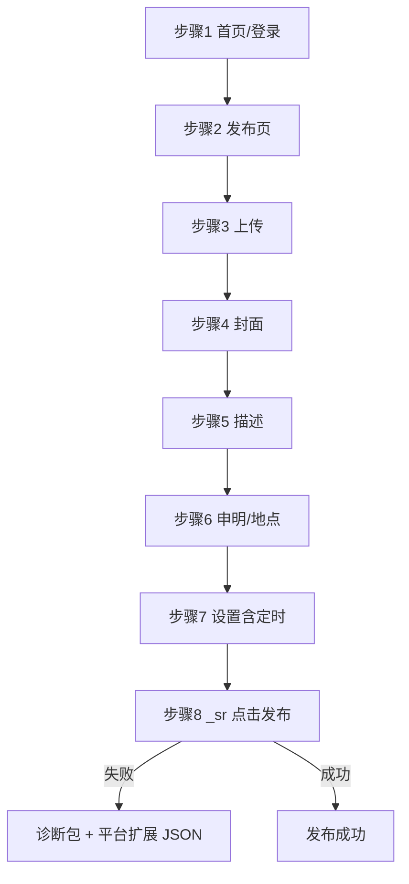

# 小红书插件技术文档

| 项目 | 内容 |
|------|------|
| **文档名称** | 小红书插件技术文档 |
| **文档版本** | v1.0 |
| **最后更新时间** | 2026-05-25 |
| **源码路径** | `src/plugins/pro/xiaohongshu/` |
| **平台入口** | `https://creator.xiaohongshu.com/` |

**文档简介**：本文档面向开发者和 AI 工具，介绍小红书发布插件的步骤链、closed Shadow 发布钮、定时设置与提交逻辑、选择器探针，以及发布失败时的平台扩展诊断包。改版时请同步更新页首「文档版本」和「最后更新时间」。

---

## 1. 文件结构

```
src/plugins/pro/xiaohongshu/
├── publish_plugin.py              # 发布插件主入口，组装 8 步步骤链
├── login_plugin.py                # 登录插件
├── selectors.py                   # 全局选择器（LOGIN、PUBLISH、SETTINGS 等）
├── publish_failure_diagnostics.py # 发布失败诊断平台扩展
├── _xhs_submit_probe.py           # xhs-publish-btn / _sr 探针与点击
├── config.json                    # 插件本地 limits 等
├── steps/
│   ├── __init__.py                # 步骤索引说明
│   ├── _base.py                   # BasePublishStep、StepOutcome
│   ├── _schedule_picker.py        # 定时浮层关闭、失焦
│   ├── step_runner.py             # StepRunner + RunnerConfig
│   ├── step_01_home.py            # NavigateHomeStep
│   ├── step_02_entry.py           # EnterPublishEntryStep
│   ├── step_03_upload.py          # UploadMediaStep
│   ├── step_04_cover.py           # CoverSettingStep
│   ├── step_05_description.py     # MetadataFillStep
│   ├── step_06A_original_declaration.py  # OriginalDeclarationStep（占位/扩展）
│   ├── step_06B_work_declaration.py      # WorkDeclarationStep
│   ├── step_06C_location.py              # LocationStep
│   ├── step_07_settings.py        # PublishSettingsStep
│   └── step_08_submit.py          # SubmitStep
└── scripts/                       # 可选浏览器脚本
```

---

## 2. 步骤链组装逻辑（视频与图文）

| 步骤 | 核心类名 | 视频 | 图文 | 说明 |
|:---|:---|:---:|:---:|:---|
| 1 | `NavigateHomeStep` | ✓ | ✓ | 首页、登录态 |
| 2 | `EnterPublishEntryStep` | ✓ | ✓ | 进入发布编辑页 |
| 3 | `UploadMediaStep` | ✓ | ✓ | 视频 / 多图上传 |
| 4 | `CoverSettingStep` | ✓ | 多跳过 | 视频封面 |
| 5 | `MetadataFillStep` | ✓ | ✓ | 标题、正文、话题 |
| 6A | `OriginalDeclarationStep` | 按配置 | 按配置 | 原创申明 |
| 6B | `WorkDeclarationStep` | 按配置 | 按配置 | 作品申明 |
| 6C | `LocationStep` | 按配置 | 按配置 | 地点 |
| 7 | `PublishSettingsStep` | ✓ | ✓ | 见 §3 |
| 8 | `SubmitStep` | ✓ | ✓ | closed Shadow 提交，见 §3 |

`publish_plugin.py` 根据 `metadata["file_type"]`（`video` / `image`）组装同一 8 步列表；步骤 6A–6C、7 内部按字段是否配置决定执行或跳过。

---

## 3. 各步骤要点

### step_07_settings.py — PublishSettingsStep

- **视频**：`privacy_settings`（公开/好友/私密）、`schedule_time` / `scheduled_publish_time`（定时）。
- **图文**：在上述基础上支持 `xiaohongshu_allow_co_create`、`xiaohongshu_allow_copy_content`（布尔，缺省 True）。
- 定时交互后调用 `_schedule_picker.dismiss_schedule_date_picker_and_wait`、`blur_publish_form_focus`，避免步骤 8 宿主 `submit-disabled=true`。

### step_08_submit.py — SubmitStep

- 宿主：`xhs-publish-btn[is-publish='true']`，属性 `submit-text`（「发布」/「定时发布」）、`submit-disabled`。
- **点击主路径**：`host.evaluate` 内 `el._sr.querySelector('button.ce-btn.bg-red').click()`（closed Shadow，页面侧 `shadowRoot` 与 `>>` pierce **无效**）。
- 提交前等待 `submit-disabled` 非 `true`；失败前 `_attach_submit_diagnostic_snapshot` 写入 `metadata._diagnostic_context.xhs_publish_snapshot`。
- **成功判定**：URL 含 `published=true` 或 `/publish/success`，或页面「发布成功」文案（见 `_xhs_submit_probe.url_indicates_publish_success`）。

### closed Shadow 与探针

| 方式 | 是否可靠 |
|------|----------|
| `host.evaluate` + `el._sr` | 是（主路径） |
| `page.locator(">> button")` pierce | 否（closed，count 常为 0） |
| `dom_snapshot.json` 内 Shadow 子树 | 否（仅 open shadow） |

`publish_plugin.py` 注入 `selector_probes`（失败时写入 `selector_probes.json`）：

| 探针键 | 用途 |
|--------|------|
| `xhs_publish_host` | 主文档侧 `xhs-publish-btn` 宿主 |
| `schedule_wrapper` | 定时区域容器 |
| `schedule_picker` | 定时日期浮层 |

pierce 计数为 0 **不代表**页面无发布钮；以 `xhs_publish_probe.json` 中 `srAccessMethod` 为准。

---

## 4. StepRunner 执行引擎

位于 `steps/step_runner.py`，继承 `src/plugins/core/step_runner.GenericStepRunner`。

```python
runner = StepRunner(
    page=page,
    file_path=file_path,
    metadata=metadata_for_runner,
    config=RunnerConfig(
        max_step_retries=3,
        step_retry_delay_seconds=1.5,
        max_submit_retries=2,
        screenshot_platform="xiaohongshu",
    ),
)
```

- 失败时 `_diagnose()` → `PageDomDiagnosticPlugin.capture(platform="xiaohongshu", ...)`。
- `metadata_for_runner` 含 `selector_probes`、`anti_risk_config`、任务字段。

---

## 5. 发布失败诊断（平台扩展）

通用诊断能力见 [3.1 第 5.5 节](../3.1插件系统标准化目录及结构.md)、[3.2 第 6.1 节](../3.2插件选择器标准化规范.md)。

小红书在 `PageDomDiagnosticPlugin._PLATFORM_EXTRA_CAPTURE` 中注册 `capture_xiaohongshu_extras`（`publish_failure_diagnostics.py`）。

**诊断包路径**：

`%LOCALAPPDATA%\WeMediaBaby\debug\diagnostics\xiaohongshu\<YYYYMMDD>\<HHMMSS>_<StepName>_<hash>/`

**除通用文件外的平台文件**：

| 文件 | 说明 |
|------|------|
| `xhs_publish_snapshot.json` | `snapshot_xhs_publish_btn`：宿主数、submit-disabled、定时浮层、Shadow 内按钮列表 |
| `xhs_publish_probe.json` | 宿主 evaluate：`_sr` / `shadowRoot`、`evaluate_sr_red_button_state` |
| `platform_analysis.json` | `hints`、`likely_causes`、`recommended_checks` |
| `分析说明.txt` | 上述分析的中文摘要 |

**与步骤 8 去重**：若 `_diagnostic_context` 已有步骤 8 attach 快照且现场无宿主，优先用 attach 并标 `source: step_attach`；否则现场采集。

**UI**：`publish_list_page` 在 `platform=xiaohongshu` 时读取 `platform_analysis.json` 的 `hints` 传入 `PublishDiagnosticDialog`。

字段明细与 OpenClaw 实采结论见：[小红书_视频发布_步骤8提交钮DOM分析报告_20260525.md](../OpenClaw%20报告分析报告/小红书_视频发布_步骤8提交钮DOM分析报告_20260525.md) 中「失败诊断包字段说明」。

---

## 6. 登录插件

`login_plugin.py` 实现 `LoginPluginInterface`：创作者首页登录态检测、用户信息提取、Cookie HTTP 验证。登录 URL 与 Cookie 域见 `config/platforms/xiaohongshu.json`。

---

## 7. 表单字段（FormSchema）

`get_form_schema(content_type)` 主要字段：

| 字段 | 说明 |
|------|------|
| `title` | 标题（默认最多 20 字） |
| `description` | 正文 |
| `tags` | 话题 |
| `privacy_settings` | 可见性 |
| `schedule_time` / `scheduled_publish_time` | 定时发布 |
| `xiaohongshu_allow_co_create` | 图文：允许合拍 |
| `xiaohongshu_allow_copy_content` | 图文：允许复制正文 |

字数上限从 `config/platforms/xiaohongshu.json` 或插件 `config.json` 的 `limits` 读取。

---

## 8. 发布流程图



---

## 9. OpenClaw / DOM 参考报告索引

| 报告 | 主题 |
|------|------|
| [小红书发布按钮验证总结.md](../OpenClaw%20报告分析报告/小红书发布按钮验证总结.md) | _sr 点击与验证结论 |
| [小红书_视频发布按钮 DOM 分析报告_20260525.md](../OpenClaw%20报告分析报告/小红书_视频发布按钮%20DOM%20分析报告_20260525.md) | 发布钮 DOM |
| [小红书_视频发布_步骤8提交钮DOM分析报告_20260525.md](../OpenClaw%20报告分析报告/小红书_视频发布_步骤8提交钮DOM分析报告_20260525.md) | 步骤 8、失败诊断包 |
| [小红书_视频发布_声明地点可见定时DOM分析报告_20260525.md](../OpenClaw%20报告分析报告/小红书_视频发布_声明地点可见定时DOM分析报告_20260525.md) | 步骤 6–7 区域 |
| [小红书视频发布设置页DOM分析报告_2026-05-21.md](../OpenClaw%20报告分析报告/小红书视频发布设置页DOM分析报告_2026-05-21.md) | 设置页历史分析 |

本地探针脚本：`scripts/dev/probe_xhs_publish_submit.py`。

---

## 10. 与其他平台的主要区别

| 维度 | 小红书 | 抖音/快手 | 视频号 |
|------|--------|-----------|--------|
| 发布钮 DOM | closed Shadow + `_sr` | 主文档可 locator | wujie-app open/穿透 |
| 诊断扩展 | 有 `publish_failure_diagnostics` | 仅通用诊断包 | 仅通用诊断包（探针待补） |
| 步骤数 | 8 | 9 / 11 | 9 阶段（内部子步更多） |
