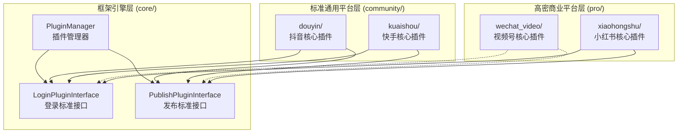
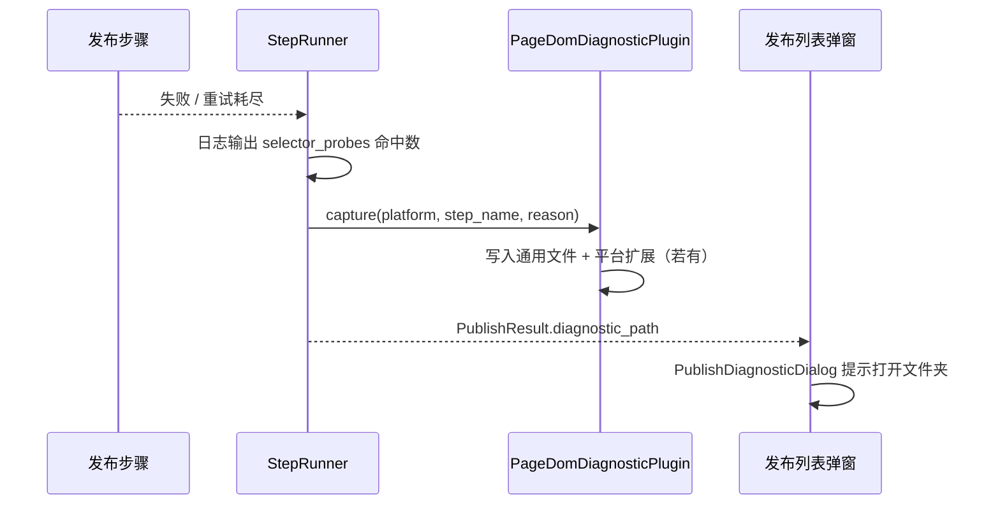

# 3.0 插件系统介绍

| 项目 | 内容 |
|------|------|
| **文档名称** | 3.0 插件系统介绍 |
| **文档版本** | v1.0.15 |
| **最后更新时间** | 2026-05-30 |
| **更新时软件版本** | 1.3.9（与当前主程序/安装包版本号一致；改版时请同步更新本行与「文档版本」） |

**文档简介**：本文档围绕「3.0 插件系统介绍」进行说明，供产品、研发与测试协作时查阅。改版时请同步更新页首「文档版本」「最后更新时间」「更新时软件版本」等元信息。

---

## 1. 系统概述

媒小宝采用**插件化架构**管理各社交平台的**登录验证**与**内容发布**能力。每个平台的功能被封装为独立插件包，通过统一接口无缝组装至主程序大单体中。

**核心特点**：

- **高度解耦**：底层平台驱动逻辑独立于主控程序，新增或修补平台插件绝不外溢影响主体稳态。
- **物理隔离**：每个平台均有严丝合缝的闭源独立目录，包含登录插件、发布模型及平台专属调度资产。
- **热插拔性**：新增平台只需在对应目录下实现既定标准接口规范，并归入 `PluginManager` 阵列库中加载。
- **密级分离**：将基础自媒体平台放置于标准通用组件目录（community）中，而高附加价值、反爬极严的特殊平台统一封存于高密商业化核心目录（pro）内。

---

## 2. 三层架构



| 层级 | 目录 | 说明 |
| :--- | :--- | :--- |
| **框架引擎** | `core/` | 定义调度接口基岩与生命周期总管，不含业务逻辑 |
| **标准通用** | `community/` | 基础短视频平台与图文分发平台接口总成区 |
| **高密商业** | `pro/` | 私域及反爬风控极高的高等级闭环封测插件区 |

---

## 3. 已实现平台一览

| 平台           | platform_id    | 分类 | 登录插件 | 发布插件 | 发布模式                    | 完善程度        |
| -------------- | -------------- | ---- | -------- | -------- | --------------------------- | --------------- |
| **抖音**       | `douyin`       | 标准 | ✅       | ✅       | 8 步步骤链 + StepRunner（视频/图文分支）     | ★★★★★（基准示范） |
| **快手**       | `kuaishou`     | 标准 | ✅       | ✅       | 11 步步骤链 + StepRunner    | ★★★★☆（主流程稳定，商品挂载/热点等步骤预留后续完善）|
| **视频号** | `wechat_video` | 高密 | ✅       | ✅       | 11 步步骤链 + StepRunner    | ★★★★☆（含 Shadow DOM 穿透，步骤链完整，选择器持续对齐中）|
| **小红书**     | `xiaohongshu`  | 高密 | ✅       | ✅       | 8 步步骤链 + StepRunner + 发布失败平台扩展诊断 | ★★★★☆（含 closed Shadow 发布钮、步骤 7/8 定时与提交） |

> 抖音插件是当前实现最完整的范本。其他平台均采用步骤链模式，但**具体步骤数量和内容由各平台自行定义**，不强制统一为 8 步。

---

## 4. 插件管理器 (`PluginManager`)

- **位置**：`src/plugins/core/plugin_manager.py`
- **加载方式**：静态导入（兼容 Nuitka/PyInstaller 打包）
- **初始化**：应用启动时调用 `PluginManager.initialize()`
- **获取插件**：
  - `PluginManager.get_login_plugin(platform_id)` → 登录插件实例
  - `PluginManager.get_publish_plugin(platform_id)` → 发布插件实例
  - `PluginManager.get_available_platforms()` → 已加载的平台 ID 列表

**新增平台时**：在 `_register_all_plugins()` 方法中添加对应的 `import` 和注册语句即可。

---

## 5. 与主程序的关系

```
主程序（main.py / UI）
    │
    ├── 登录流程 → PluginManager.get_login_plugin("douyin") → DouyinLoginPlugin
    │                  ├── check_login_status()     浏览器内在线检测
    │                  ├── extract_user_info()       提取昵称/Cookies
    │                  └── verify_account_status()   HTTP 静默验证
    │
    └── 发布流程 → PluginManager.get_publish_plugin("douyin") → DouyinPublishPlugin
                       └── publish(page, file_path, metadata) → PublishResult
```

- 插件仅提供**登录**和**发布**两类原子能力
- 批量发布、任务列表等业务逻辑在主程序中实现
- 浏览器层防风控由基础设施 (`src/infrastructure/`) 提供，插件拿到的 `page` 已在防风控环境中（含 Patchright 协议伪装、Canvas 噪声混淆与 Stealth 特征消除）
- 发布层防风控由公共模块 (`src/infrastructure/anti_risk/`) 提供，涵盖高层认知暂停、鼠标过冲与抛物线回滚，插件在步骤中按需调用

---

## 6. 发布自动化的质量规范（选择器与步骤准确度）

发布失败常见原因不是「接口没调对」，而是**页面上找错按钮、弹窗作用域不对、或成功判定与真实 DOM 不一致**。项目用 **[3.2 插件选择器标准化规范](3.2插件选择器标准化规范.md)** 统一：

- **怎么找**：Layer 1（Playwright 语义 API）→ Layer 2（稳定属性/文案）→ Layer 3（哈希兜底）；弹窗必须先 **scope** 再点内部按钮；含 **Shadow / 微前端** 时按 3.2 第 5.1 节处理。
- **怎么协作**：人工走真实流程 → **OpenClaw** 按 3.2 第 10–11 节输出 DOM 分析报告 → **Cursor** 更新 `selectors.py` 与各步 `steps/*.py` 并同步 `*DOM对照表.md`。
- **怎么排错**：**StepRunner** 在步骤失败时生成**诊断包**（页面 HTML、DOM 摘要、选择器探针、截图等），对照 3.2 第 1.4 节「准确度」四维度（唯一性、作用域、可交互、后验）复盘；详见 §6.3。

### 6.1 步骤成功/失败规则

**核心规则：步骤失败必须终止当前发布任务，不允许静默跳过。**

每个步骤的 `execute` 方法通过返回值与 StepRunner 通信：

| 返回值 | 含义 | Runner 行为 |
|--------|------|-------------|
| `None` | 本步成功 | 继续下一步 |
| `PublishResult(success=False)` | 本步失败 | 重试（最多 N 次）后终止整条发布链 |
| `PublishResult(success=True)` | 流程完成（仅 Submit 步骤使用） | 立即返回，整条链结束 |
| `NeedsAction` | 需要补救（如需要封面） | Runner 执行对应补救步骤后重试 Submit |

**判定原则：**
- **字段有值 = 必须完成**：任务配置了标题、商品名称、标签、定时时间等字段，对应步骤必须操作成功；找不到页面元素或操作异常，应返回 `PublishResult(success=False)`，不得静默 `return None`。
- **字段为空 = 直接跳过**：对应 metadata 字段为空或未配置时，步骤返回 `None` 跳过即可。
- **未实现的功能**：若某字段有值但功能尚未实现，必须返回 `PublishResult(success=False)` 并说明原因，避免以残缺数据发布内容。

详细规则与豁免说明见 **[3.1 第 5.1.1 节](3.1插件系统标准化目录及结构.md)**。

### 6.2 可信交互与「所见即所得」

发布自动化的目标是**模拟人工**：页面控件上发生的变化，应与**表单内部状态、最终提交**一致。若在 `page.evaluate` 里对 DOM 节点调用 `element.click()` 或派发合成 `MouseEvent`，在 Vue / Ant Design / 微前端（如无界子应用）场景下常出现 **`isTrusted=false`**，表现为**界面像已勾选或已改时间，但 v-model / 提交载荷未更新**，进而误判成功或提交错误数据。

工程约定（详见 [3.2 第 5.2 节](3.2插件选择器标准化规范.md)）：


- **主路径**：对会驱动业务状态的点击（单选、复选、时间选择器格子、弹窗确认、发表等），优先 **`page.mouse.click`（或 Locator / `human_click`）**，必要时先用 `getBoundingClientRect` 计算视口中心。
- **物理滚动**：针对可能被各大平台风控脚本捕获的视口跳变特征，全平台的页面滚动操作已统一接入基础设施层的纯物理级模拟。必须使用 `HumanBehavior.scroll_to_bottom` 或 `scroll_to_locator`（采用 `mouse.wheel` 分段施加阻尼），**严禁**使用 `window.scrollTo`、`window.scrollBy` 或原生的 `el.scrollIntoView({behavior: 'instant'})`。
- **读状态**：仍可用 `evaluate` **只读**查询 DOM / 高亮项做后验；**禁止**把「仅改 class / 仅合成点击」当作可靠成功路径。
- **各平台**：视频号步骤 8（定时）、10（原创）、11（发表）已按上述方式收敛；抖音、快手等社区插件以及小红书等高密插件，已在全域范围完成了滚轮物理化与鼠标真实化的普及。不再用 `evaluate` 内 `el.click()` 作为定时确认等关键步骤的兜底。

### 6.3 发布失败页面诊断（通用）

任一步骤失败且启用诊断时，执行链如下：



- **模块**：`src/plugins/core/diagnostics/page_dom_diagnostic.py`
- **存储**：`%LOCALAPPDATA%\WeMediaBaby\debug\diagnostics\<platform_id>\<日期>\<时间>_<步骤>_<原因哈希>/`
- **通用文件**：`page.html`、`screenshot.png`、`dom_snapshot.json`、`selector_probes.json`、`metadata.json`、`console.jsonl`、`network_summary.json`
- **平台扩展**：注册表 `_PLATFORM_EXTRA_CAPTURE`；当前 **小红书** 额外写入 `xhs_publish_snapshot.json`、`xhs_publish_probe.json`、`platform_analysis.json` 等（详见 [04小红书插件/小红书插件技术文档.md](04小红书插件/小红书插件技术文档.md)）
- **配置与接口细节**：[3.1 第 5.5 节](3.1插件系统标准化目录及结构.md)、[3.2 第 6.1 节](3.2插件选择器标准化规范.md)

---

## 7. 文档索引

| 编号  | 文档                     | 内容                                               |
| ----- | ------------------------ | -------------------------------------------------- |
| 3.0   | 本文档                   | 插件系统总体介绍与平台一览（含步骤失败终止规则、通用诊断） |
| 3.1   | 插件系统标准化目录及结构 | 标准化目录方案、接口规范、步骤成功/失败判定规则、PageDomDiagnosticPlugin |
| 3.2   | 插件选择器标准化规范     | 分层选择器、弹窗 scope、Shadow、诊断包与探针、OpenClaw 报告格式 |
| 01    | [抖音插件功能说明](01抖音插件/抖音插件功能说明.md) / [技术文档](01抖音插件/抖音插件技术文档.md) | 9 步视频/图文、发布失败诊断 |
| 02    | [快手插件功能说明](02快手插件/快手插件功能说明.md) / [技术文档](02快手插件/快手插件技术文档.md) | 11 步、发布失败诊断 |
| 03    | [视频号插件功能说明](03视频号插件/视频号插件功能说明.md) / [技术文档](03视频号插件/视频号插件技术文档.md) | 9 阶段、Shadow、发布失败诊断 |
| 04    | [小红书插件功能说明](04小红书插件/小红书插件功能说明.md) / [技术文档](04小红书插件/小红书插件技术文档.md) | 8 步、closed Shadow、平台扩展诊断 |