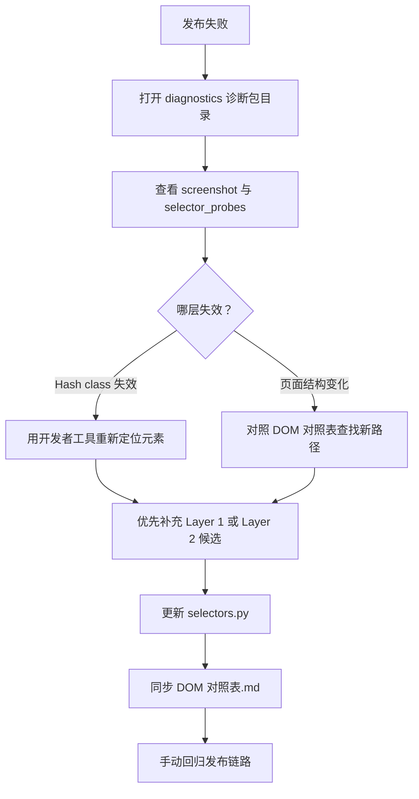

# 3.2 插件选择器标准化规范

| 项目 | 内容 |
|------|------|
| **文档名称** | 3.2 插件选择器标准化规范 |
| **文档版本** | v1.0.13 |
| **最后更新时间** | 2026-05-28 |
| **更新时软件版本** | 1.3.9（与当前主程序/安装包版本号一致；**仅改文档未发版时**可只升「文档版本」、本行保持安装包版本） |

**文档简介**：本文档围绕「3.2 插件选择器标准化规范」进行说明，供产品、研发与测试协作时查阅。改版时请同步更新页首「文档版本」「最后更新时间」「更新时软件版本」等元信息。

---

## 0. 快速阅读指引（三类读者）

本文档同时面向三类读者，请按需跳转：

| 你是谁 | 需要关注的章节 |
|--------|----------------|
| **我（项目负责人）**：想了解整体逻辑，让工具协作完成功能 | 第 0 节（本节）+ 第 9 节（协作流程总览） |
| **OpenClaw（AI 浏览器代理）**：需要打开浏览器帮我分析页面并生成报告 | 第 10 节（含排他信息）+ 第 11 节（报告格式）+ 第 5.1 节（若含 Shadow） |
| **Cursor AI（编程助手）**：接收 OpenClaw 报告后更新插件代码 | 第 1.4 节（准确度）+ 第 2–8 节（技术规范）+ 第 5.1 节（Shadow）+ 第 11 节（报告格式） |

### 整体协作流程（一句话版本）

> **我操作浏览器** → OpenClaw 在旁边分析页面、写报告 → **我把报告发给 Cursor AI** → Cursor AI 更新插件代码

---

## 1. 目标与边界

### 1.1 目标

- 将**首选定位方式**从「依赖打包哈希 class」改为「依赖语义与稳定属性」。
- 统一**候选列表排序规则**：稳定优先、脆弱兜底。
- 统一**弹窗内操作**的作用域，避免跨层误点。
- 与现有 **StepRunner 诊断（探针 + 截图）** 衔接，便于改版后快速修复。
- 将**控件定位准确度**（唯一性、作用域、可交互、可验证）写成可执行标准，并与 OpenClaw 报告字段对齐，减少「找错按钮、误判成功」类故障。

### 1.2 边界说明（诚实预期）

- **无法保证 100% 命中**：站点 A/B、灰度、反自动化、网络与登录态等均可能导致失败。
- 本规范的目标是：**在可控范围内最大化稳定性**，并缩短「改版 → 修复选择器」的周期。

### 1.3 易混淆说明（报告 vs 代码）

| 容易混在一起的点 | 实际约束对象 | 正确理解 |
|------------------|--------------|----------|
| 第 2.1 / 3.1 节「优先 Layer 1」「候选第一项非哈希」 | **`selectors.py` 与 steps 实现** | 约束插件代码里怎么写定位，**不是**禁止 OpenClaw 在报告里写 `[ref=e…]` 等取证信息。 |
| 报告里的 `ref`（如 e1598） | **DOM 分析报告（第 10–11 节）** | 允许记录，便于对照截图与工具链；**是否写入 `selectors.py` 首候选**由第 10.2 条「可稳定查询」与第 11.4 第 7 条决定。 |
| 表格列「操作结果」 | **报告** | 与第 10.2 ④「操作结果」对应；有的审查里叫「点击效果」，**与本规范表头同义**。 |

### 1.4 控件定位准确度目标

本规范中「准确度」指：自动化在真实页面上**找对元素、点对按钮、填对框**，并在操作后**能可靠判断成败**。建议从四个维度自检：

| 维度 | 含义 | 常见反例 |
|------|------|----------|
| **唯一性** | 同名控件（多个「确定」「上传」）必须用**弹窗标题、表单项 label、父级稳定特征**等缩小到唯一目标 | 全页 `get_by_text('确定')` 点到错误弹窗 |
| **作用域** | 先确定 **页面区 / dialog / modal / shadow 子树**，再在 scope 内查找子元素 | 弹窗内按钮用全页 `page.locator` 命中页面上另一个同名按钮 |
| **可见性与可交互** | 点击前等待 **可见**；提交类按钮注意 **disabled**（如转码中） | 点到 `display:none` 或遮罩下的节点 |
| **操作后验** | 每一步至少一种**用户可见**成功信号：Toast 文案、URL 变化、关键文案出现/消失、表单展示值变化 | 仅用「某哈希 class 是否出现」作为唯一成功条件 |

以上与第 3 条第 5 点（成功判定优先文案/状态）一致；**StepRunner 失败截图**应对照上述维度排查是「选错元素」还是「成功判定写错」。

---

## 2. 三层防御体系

### 2.1 分层定义

```
Layer 1 — 语义层（最稳定，首选）
  Playwright：get_by_role / get_by_placeholder / get_by_label / get_by_text
  依赖：可访问性树（ARIA role + accessible name），与 CSS class 解耦。

Layer 2 — 属性与文案层（中等稳定）
  示例：[role='dialog']、[contenteditable='true']、input[type='file']、
        [data-placeholder='...']、:has-text('固定文案')（选择器中不含哈希 class）
  依赖：HTML 标准属性、业务稳定文案、Semi 等框架级语义。

Layer 3 — 哈希层（脆弱，仅兜底）
  示例：btn-OkpBsP、video-_cFVs8、button-dhlUZE、primary-RstHX_ 等打包后缀 class
  特征：前端构建产物变更即可能整体失效。
  规则：每个 key 的候选列表中，**哈希选择器只能排在最后**，且尽量配合文案或父级稳定范围。
```

### 2.2 选用决策（简表）

| 场景 | 优先 Layer | 说明 |
|------|------------|------|
| 按钮（有可见文案） | L1 `get_by_role('button', name=...)` | 注意同名多按钮时需缩小作用域 |
| 单选/复选（带文案 label） | L1 `get_by_role('radio'/'checkbox', name=...)` | 与 Semi 等组件兼容时需实测 |
| 输入框 | L1 `get_by_placeholder` 或 L2 `input[placeholder='...']` | 文案变更时需更新文档 |
| 富文本 editor | L2 `contenteditable` + `data-placeholder` | 慎用仅含哈希 class 的路径 |
| 弹窗内按钮 | L1，且**必须先取 dialog 作用域** | 见第 4 节 |
| file 上传 | L2 `input[type='file']` + accept/父级稳定区域 | 可保留多候选 |
| 首页卡片入口 | L1 `get_by_text`（精确文案） | 避免仅用卡片哈希 class |

---

## 3. 选择器编写规则（六条）

1. **首选 Layer 1**  
   每个 `Selectors` 键在**实现层**应优先尝试语义 API；若当前代码仍以字符串选择器为主，则**候选列表第一项**应为不含哈希的稳定字符串（或文档中明确「实现时先走 get_by_*」）。

2. **弹窗操作必须有容器作用域**  
   对 `role='dialog'` / `aria-modal='true'` 的容器先定位，再在其内部查找按钮、输入框；禁止在整页上裸用 `button:has-text('完成')` 若页面可能存在多个同类按钮。

3. **候选列表按稳定性降序排列**  
   顺序：语义等价描述 → 属性/文案 CSS → 框架级 class（如 `semi-button-primary`）→ **哈希 class（最后）**。

4. **哈希 class 禁止单独作为唯一手段**  
   若必须使用 Layer 3，须配合 `:has-text(...)`、父级稳定 id（如业务根节点）、或 `nth` 等缩小范围，并在 DOM 对照表中标注「易碎」。

5. **成功判定优先用文案或状态**  
   例如「发布成功」Toast、「封面效果检测通过」、`修改音乐` 等；避免用「仅哈希 class 出现」作为唯一成功条件。

6. **DOM 对照表与 selectors.py 同步**  
   任一键增删改后，须更新对应平台的 `*DOM对照表.md` 中「代码键名 / 策略层级 / 备注」列，便于人工与 AI 协同维护。

---

## 3.1 实现层约定（selectors.py 与 steps 的双轨）

本规范里，“Layer1/2/3”是**候选策略**，但工程落地行为分成两条轨道：

1. `selectors.py`（字符串候选列表为主）
   - 候选列表顺序必须满足：Layer1（语义/稳定属性，优先不含哈希）→ Layer2（属性/文案）→ Layer3（哈希兜底）。
   - 若 steps 仍使用 `page.locator(sel)` 走字符串候选，则**候选列表第一项必须是不含哈希且尽量具备唯一性的稳定字符串**；哈希 class 只能出现在末尾。

2. `steps/*.py`（按钮/输入/弹窗内部的落地真源）
   - 当需要操作“弹窗/确认框/风控层/封面弹窗”这类具有容器语义的元素时，steps 必须先拿到 `scope`（dialog/modal 的 Locator），并且后续只在 `scope` 内查找按钮/输入框。
   - steps 遍历候选时，只能在同一个 `scope` 下进行，不得跨 scope 用同一套 selector 直接全页命中。

### 3.2 每步实现模板（给 `steps` 作者）

单步发布的推荐结构（与第 1.4 节准确度维度对应）：

```
1. 解析 scope
   - 主文档区 / 某块表单 / get_by_role('dialog').filter(标题) / shadowRoot（见第 5.1 节）
2. 在 scope 内定位——严格单一选择器
   - 只取 selectors.py 候选列表的第一项（最稳定选择器）
   - 找不到或 is_visible() 为 false → 立即 return PublishResult(success=False)
   - 禁止遍历候选列表作为多路兜底（候选列表仅供维护参考，运行时只用第一项）
3. action：`click`（须优先可信指针：`Locator.click` / `page.mouse.click` / `human_click`，见第 5.2 节）/ `fill` / `set_input_files` / `keyboard`
4. verify：用户可见成功信号（文案、Toast、URL、展示值），与「成功判定汇总」一致
   - 文本填写：evaluate 读回 innerText / value，为空 → return PublishResult(success=False)
   - 跳转验证：只接受精确 URL 路径 + is_visible 特征元素，禁止宽泛文案匹配
```

**分工约定**：

- **`selectors.py`**：维护**字符串候选列表**的顺序（稳定 → 易碎），键名与 DOM 对照表一致。候选列表可保留多项供维护人员参考，但运行时步骤代码只使用第一项。
- **`steps/*.py`**：只取候选列表第一项，不遍历多候选，找不到即失败；维护 **scope 的获取方式** 及与 Shadow/iframe 匹配的**探测与校验**。

> ⚠️ **严禁** 在 `steps` 中编写「主方案失败则静默切换备用方案继续执行」的逻辑，这将导致日志与实际结果不一致，在批量发布场景造成严重事故。

页面大改版时，往往**同时**需要改 `selectors.py` 与 `steps`（仅改一处可能仍找不到或判错）。

---

## 4. 弹窗与抽屉的标准模式

### 4.1 三步模板（locator → scope → action）

1. **locator**：`dialog = page.get_by_role('dialog').filter(has_text='…')` 或 `page.locator("[role='dialog']:has-text('…')").first`（按平台实测二选一）。
2. **scope**：后续所有点击、填写均在 `dialog` 链式下完成，例如 `dialog.get_by_role('button', name='确定')`。
3. **action**：`click` / `fill` / `set_input_files`；完成后用**关闭**或**页面状态**校验，而非仅依赖 class 消失。

4. **硬约束（必须遵守）**
   - 一旦检测到弹窗/模态层（dialog/modal），steps 内部禁止直接使用全页查找去定位弹窗内按钮与输入框（例如 `page.locator("button:has-text('完成')")`）。
   - 弹窗内按钮/输入框必须从 `scope` 开始查找（`scope.locator(...)` 或 `scope.get_by_role(...)`）。

### 4.2 多弹窗叠加

- 优先用 **标题文案** 区分（如「设置竖封面获更多流量」与主封面弹窗）。
- 仍冲突时，使用 **filter** 限定可见且最上层（Playwright 的 `locator.filter` + `visible` 检测）。

### 4.3 侧栏 / 抽屉（非 dialog）

- 用 **稳定文案入口**（如「选择音乐」）打开后，在**侧栏可见区域**内查找 `placeholder`、列表行与「使用」按钮。
- 关闭方式：Escape 或明确关闭按钮，需在步骤内与文档中写清。

---

## 5. 反模式（禁止或谨慎）

| 反模式 | 风险 | 建议 |
|--------|------|------|
| 整条选择器仅由哈希 class 组成 | 发版即挂 | 改为 L1/L2，哈希放最后 |
| 深链 `div.xxx > div.yyy:nth-child(2)` 无文案锚点 | 结构微调即挂 | 增加 `has-text` 或 role 锚点 |
| 全页 `get_by_text('发布')` | 误点其它「发布」 | 缩小到工具栏/底部栏或使用 `exact` + `nth` |
| 忽略 iframe / shadow DOM | 永远找不到 | 平台文档中单独说明（若存在） |
| 成功判断绑定哈希容器 class | 误判或漏判 | 改用用户可见文案 |
| 关键步骤用 `evaluate` 内 `node.click()` 或合成 MouseEvent 当主路径 | Vue/Ant 等不更新 model，界面假成功 | 第 5.2 节：改为真实 `mouse.click` 或 Locator |
| **步骤代码遍历多个候选选择器（兜底）** | **日志显示成功但实际未发布，批量发布场景造成事故** | **只取候选列表第一项；找不到立即返回失败** |
| **填写后不验证 innerText / value** | **输入框静默写入失败，步骤仍报成功** | **填写后必须读回验证；为空返回 PublishResult(False)** |
| **发布成功判定使用宽泛 URL 条件（如含 `content`）** | **发布编辑页 URL 也含该关键字，误判成功** | **只接受精确 URL 路径（如 `content/manage`、`article/manage`）** |
| **`count() > 0` 作为成功判定（不检查 is_visible）** | **隐藏元素或导航栏元素误判页面状态** | **必须同时检查 `is_visible()` 为真** |

### 5.1 Shadow DOM 与微前端（视频号等）

部分平台将发布页放在 **Web Components / 微前端**（如 `wujie-app`）内，使用 **Shadow DOM**。此时需注意：

1. **Playwright `page.locator` 能否直达内部节点取决于浏览器与穿透写法**，必须以**各平台实测**为准；不可假设「写在 `selectors.py` 里的 CSS 一定能被 `page.locator` 命中」。
2. 若工程上采用 **`page.evaluate` + `element.shadowRoot.querySelector(...)`** 作为主路径：OpenClaw 报告须记录 **Shadow 宿主标签名**、**宿主在 light DOM 中的可描述路径**，以及 **shadow 内相对选择器**（从 `shadowRoot` 起算）。
3. **禁止**在 **Shadow 内部的 `querySelector` 字符串**中使用 **Playwright 专有伪类**（如 `:has-text(...)`）。Shadow 内仅适用标准 CSS（或 `evaluate` 里用 `textContent`/`innerText` 遍历）；全页 `page.locator` 仍可使用 Playwright 扩展语法（若该 locator 不进入 Shadow 或已正确穿透）。
4. **成功/失败判定**必须与步骤实际探测方式一致：若元素仅在 Shadow 内，**不得**仅用未穿透的 `page.locator` 等待成功（易**假阴性超时**）；应在 **同一 shadow 子树**内轮询或与 `evaluate` 一致。

平台特例、推荐宿主路径与步骤编号见各平台 `*DOM对照表.md`（如 [03视频号插件/3.3.4视频号插件DOM对照表](03视频号插件/3.3.4视频号插件DOM对照表.md)）。

### 5.2 可信点击与禁止「假操作」（所见即所得）

**问题**：在 Shadow / 微前端 + 前端框架（Vue/React）页面中，`page.evaluate(() => node.click())` 或 `dispatchEvent(new MouseEvent('click', …))` 产生的点击 **`event.isTrusted === false`**。部分组件只在**真实指针事件**上更新内部状态；结果可能是**样式已变、class 已加，但表单 model、接口入参与用户真机操作不一致**（典型：定时时间显示与提交不一致、原创勾选与发表后二次弹窗不一致）。

**规范**：

1. **会改变提交数据或关键流程状态的交互**（勾选、单选、日期/时间面板内选项、弹窗「确定/声明原创」、主「发表」按钮等）：**主路径**须使用 **`page.mouse.click(x, y)`**（坐标来自目标元素 `getBoundingClientRect` 中心）或 **Playwright Locator 的 `click` / 项目内 `human_click`**。Shadow 内可先 `evaluate_handle` 取节点再算坐标，或复用各平台封装的 `shadow_mouse` 类工具。
2. **`evaluate` 的合理用途**：定位 shadow 子树、**只读**读取展示值与高亮项、滚动、以及无法避免时的探测；**不应**作为上述关键点击的主实现。
3. **兜底策略**：对已知不可靠的 `evaluate` + `click()` **不再保留为兜底**（与「假成功」相比，宁可明确失败并提示用户勿遮挡窗口、重试）。若 Locator 点击失败，可降级为**同一元素的视口中心 `mouse.click`**，而不是合成 DOM 事件。
4. **风控**：真实指针轨迹配合既有 `human_click` / 随机延迟，更贴近人工；纯脚本注入批量点 DOM 易与正常用户行为分布不一致，应减少滥用。

**落地参考**：`src/plugins/pro/wechat_video/shadow_mouse.py`；视频号 `step_08_schedule.py`（定时单选、翻月箭头、日期时间选择）、`step_10_original.py`、`step_11_submit.py`；快手 `step_10_settings.py` 定时弹窗「确定」在拟人点击失败时使用 `bounding_box` + `mouse.click`。

---

## 6. 与现有工程结构的衔接

- **选择器集中管理**：仍放在各平台 `selectors.py`；本规范约束的是**写法优先级与文档同步**，不强制立即废弃字典结构。
- **步骤实现**：`steps/*.py` 中可对同一语义先调用小型解析函数：`try Layer1 → except/失败则遍历 selectors 列表`（具体实现见各平台优化方案）。
- **诊断**：见下文 **§6.1 发布失败诊断包**；`selector_probes` 键名宜与 `selectors.py` 可对照。
- **防风控**：`human_click` / `human_type_text` 等可与 **Locator** 对象配合使用（传入 locator 而非仅字符串时更符合 L1）。

### 6.1 发布失败诊断包

发布步骤失败且 `RunnerConfig.diagnostics_on_error=true` 时，由 `PageDomDiagnosticPlugin`（`src/plugins/core/diagnostics/page_dom_diagnostic.py`）写入本地诊断包（路径见 [3.1 第 5.5 节](3.1插件系统标准化目录及结构.md)）。

**`selector_probes` 约定**（在 `publish_plugin.publish()` 注入 `metadata["selector_probes"]`）：

| 平台 | 示例探针键 | 对应选择器语义 |
|------|------------|----------------|
| 抖音 | `submit_btn`、`cover_btn`、`file_input_video` | `Selectors.PUBLISH` / `HOME` |
| 快手 | `submit_btn`、`upload_success`、`desc_editor` | `Selectors.PUBLISH` |
| 小红书 | `xhs_publish_host`、`schedule_wrapper`、`schedule_picker` | 宿主 `xhs-publish-btn`、定时区（**不以 pierce `>>` 为唯一依据**） |

失败时 `selector_probes.json` 记录各键的 `count`、`visible`、`text`（脱敏）。日志中 `[probe] key -> count` 与文件内容一致。

**Shadow / closed Shadow 注意**：

- `dom_snapshot.json` 仅汇总 **open** `shadowRoot` 内元素。
- 小红书底部 `xhs-publish-btn` 为 **closed Shadow**，内部红钮不会出现在 `dom_snapshot` 中；须查看 `xhs_publish_snapshot.json`、`xhs_publish_probe.json`（平台扩展）。
- 视频号发布页在 `wujie-app` Shadow 内时，通用快照可能不完整，须结合平台步骤内的 Shadow 穿透探针与截图。

**排错顺序建议**：`screenshot.png` → `selector_probes.json` → `platform_analysis.json`（若有）→ `dom_snapshot.json` / 平台专用 JSON → `page.html`。

---

## 7. 选择器维护工作流



### 7.1 回归检查清单（最小集）

- [ ] 登录态下从首页进入发布页（视频 / 图文各一次，若平台支持）
- [ ] 上传 → 填写标题/描述 → 封面（若启用）→ 设置 → 提交
- [ ] 故意触发一种已知弹窗（如补充信息），确认兜底逻辑仍可用
- [ ] 失败时诊断包目录已写入 `PublishResult.diagnostic_path`，且含 `selector_probes.json`（已配置探针的平台）
- [ ] 失败时探针日志与诊断包路径可复现

### 7.2 平台插件合规检查清单（自检用）

在把新选择器/新步骤交给其他平台复刻前，必须完成以下自检：

- [ ] `selectors.py` 的每个 key：候选列表中首选不是哈希 class，哈希只作为最后兜底
- [ ] 进入弹窗/模态层后：steps 是否先获得 `scope`（dialog/modal 的 Locator），并且所有弹窗内按钮/输入都从 `scope` 查找
- [ ] 成功判定是否以文案/状态/页面变化为主，而不是依赖 hash class 是否消失
- [ ] 同页存在多个同名按钮（如多个“确定/完成”）时：steps 是否用弹窗容器或标题文案避免误点
- [ ] OpenClaw 报告「可稳定查询」列：仅当为 **是** 时，才允许将对应 ref 相关路径列入 `selectors.py` **前列**；为 **否/未知** 时须按第 11.4 第 7 条处理
- [ ] 若控件在 **Shadow / iframe** 内：**成功判定与等待**是否与步骤实际使用的探测方式一致（`evaluate` 穿透 vs 未穿透的 `page.locator`），避免混用导致误判超时或假成功
- [ ] **关键点击**是否避免以 `evaluate` 内 `node.click()` / 合成 `MouseEvent` 为主路径（见第 5.2 节）；状态变更是否可用只读 `evaluate` 或用户可见结果做后验

---

## 9. 三方协作流程总览

> 本节说明「我 + OpenClaw + Cursor AI」如何配合完成一次插件选择器的采集与更新。

### 9.1 整体流程图

```
我（操作浏览器）
    │
    ▼
OpenClaw 打开浏览器，旁观分析
    │  我在浏览器里手动完成完整发布流程（上传→填写→封面→设置→发布）
    │  OpenClaw 按第 10 节要求，记录每一步用到的 DOM 元素信息
    ▼
OpenClaw 生成「平台发布操作 DOM 分析报告」
    │  格式严格按第 11 节规范
    ▼
我把报告文档发给 Cursor AI（直接粘贴或 @文件）
    ▼
Cursor AI 读取报告，对照现有 selectors.py 逐一更新选择器
    │  按三层防御体系排列候选列表
    │  同步更新 DOM 对照表.md
    ▼
发布插件选择器更新完成，可回归测试
```

### 9.2 什么时候需要重新跑这个流程

- 发布任务失败，日志显示「未找到按钮/元素」
- 发现抖音/快手等平台页面改版（按钮位置变了、弹窗文案变了）
- 新增平台插件时的首次 DOM 采集
- 平台页面 A/B 测试结束后固化为新版本

### 9.3 每次分析要覆盖的操作范围

以抖音视频发布为例，需要完整走完以下所有步骤（缺一不可，否则会漏掉中间步骤的 DOM）：

1. 打开抖音创作者中心首页（已登录状态）
2. 点击「发布视频」入口，进入发布页
3. 上传一个测试视频文件，等待上传完成
4. 填写标题和作品描述
5. 点击「选择封面」，操作封面弹窗，点击完成
6. 如果出现「补充信息」弹窗，点击确定/跳过
7. 设置发布权限（公开/好友/私密）
8. 点击「发布」按钮，等待成功提示

---

## 10. OpenClaw 任务说明

> **本节专为 OpenClaw 编写。** 当我让你帮我分析某个平台的发布流程 DOM 时，请阅读本节，了解你需要记录什么内容，以及如何记录。

### 10.1 你的任务是什么

当我说「帮我分析 XX 平台的发布流程」时，你需要：

1. 打开浏览器，我会手动操作网页完成发布流程的每一步
2. 每当我完成一个操作步骤（例如：我点了一个按钮、出现了一个弹窗、我填写了一个输入框），你需要**立即用浏览器开发者工具分析该元素**，记录它的 DOM 信息
3. 全程结束后，按第 11 节规定的格式，生成一份「平台发布操作 DOM 分析报告」文档

### 10.2 每个元素需要记录的信息

对于我操作的**每一个交互元素**（按钮、输入框、弹窗、文件上传区、单选框等），你都需要记录以下内容：

**① 稳定特征（最重要，按优先级记录）**

- 元素的**可见文案**（按钮上写着什么字、输入框的 placeholder 提示文字、弹窗标题文字）
- 元素的 **HTML 标签类型**（`button`、`input`、`div`、`label` 等）
- 元素的 **role 属性**（如果有 `role='dialog'`、`role='button'` 等）
- 元素的 **type 属性**（如 `type='file'`、`type='text'`、`type='radio'`）
- 元素是否有 **placeholder**、**data-placeholder** 等属性及其值
- 元素是否有 **aria-label**、**aria-modal** 等无障碍属性
- 元素是否存在 **工具链中的 `ref` 标识**（例如分析报告里写的 `[ref=e1598]`）：须同时标注 **在页面上能否被稳定查询/定位**（填 **是 / 否 / 未知**）。*说明：该 ref 多为浏览器自动化工具的临时引用，**不等同**于 DOM 里的 HTML 属性；落表时写入第 11.2 节表格的「ref（若有）」「可稳定查询」两列。*

**② 位置与结构信息**

- 该元素在页面上的**大致位置**（页面顶部/底部/左侧/右侧/弹窗内）
- 它的**父级容器**有什么稳定特征（例如父级有 `role='dialog'`，或父级有某个固定 id）
- 是否在弹窗/侧栏/下拉框内（如果是，弹窗的标题/关键文案是什么）

**③ 哈希 class（兜底，仅供参考）**

- 元素完整的 `class` 属性值（包括哈希后缀的 class，如 `button-dhlUZE`）
- **注意**：哈希 class 可能随网站发版改变，仅作最后兜底参考，不是主要依据

**④ 操作结果**

- 我点击/填写该元素后，页面发生了什么变化？（弹窗出现/消失？页面跳转？出现了什么文案？）
- 如何判断这个操作成功了？（出现了什么提示文字？）

**⑤ 排他信息（同名控件时必填）**

- 若页面上存在**多个相同或相近文案**的按钮/链接（如多个「确定」「上传」），必须写清：**属于哪一块区域**（例如「发表时间」表单项、「原创权益」弹窗）、**相邻 label 文案**、**弹窗标题**，或「第几个同类按钮」的区分依据。
- 便于 Cursor 在 `steps` 中缩小 `scope`，落实第 1.4 节的**唯一性**与第 4 节的弹窗作用域。

### 10.3 弹窗元素的特别说明

当出现弹窗时，你需要**同时记录**：

1. **弹窗本身**：弹窗容器的 role、标题文案、class 等
2. **弹窗内的每个按钮**：按钮文案、class、是否主操作按钮（红色/蓝色主题色）
3. **弹窗内的输入框或上传区域**（如果有）
4. **弹窗的关闭方式**（点击 X 按钮、点击遮罩层、按 Escape 键）

### 10.4 分析技巧

- 使用浏览器开发者工具（F12 → Elements 面板）查看选中元素的 HTML 结构
- 右键点击元素 → 检查，快速定位
- 重点关注 `role`、`type`、`placeholder`、`aria-*`、`data-*` 等属性（这些最稳定）
- 记录页面上**固定不变的文案**（中文文字最重要，因为业务文案通常不会改）
- 如果同一类操作出现多个同类按钮（如多个「确定」），记录它们的父级容器区别

### 10.5 一次分析的步骤清单

开始分析前，先问我：「你要分析哪个平台的什么功能？是视频发布还是图文发布？」

然后按以下步骤执行：

- [ ] 步骤1：打开浏览器，导航到目标平台
- [ ] 步骤2：确认我已登录（能看到用户头像/昵称）
- [ ] 步骤3：我操作，你记录，直到我说「分析结束」
- [ ] 步骤4：整理所有记录，按第 11 节格式生成报告文档
- [ ] 步骤5：输出完整报告，告诉我报告已完成

---

## 11. DOM 分析报告格式规范

> 本节规定 OpenClaw 生成报告的格式，以及 Cursor AI 读取报告后的更新规则。

### 11.1 报告文件命名规范

```
格式：{平台名}_发布操作DOM分析报告_{日期}.md
示例：抖音_视频发布DOM分析报告_20260325.md
      抖音_图文发布DOM分析报告_20260325.md
      快手_视频发布DOM分析报告_20260325.md
```

### 11.2 报告文档结构

报告必须包含以下几个部分，**顺序不能变**。

- **步骤标题**：须使用 `## 步骤X：{步骤名称}`（X 为数字；勿改用「操作步骤 X」等其它主标题格式，以免与 Cursor/清单脚本不一致）。
- **步骤内三级标题**：依次为 `### 操作说明` → `### 关键元素记录` →（若有弹窗）`### 弹窗信息`。*勿改名为「步骤说明」；「操作说明」与第 10 节表述一致。*

**关键元素记录表（必填列）**须与第 **10.2** 节对应：`role/type`、**操作结果**（10.2 ④）、**ref** 与 **可稳定查询** 不得整表遗漏；并增加 **建议 Playwright API**、**建议作用域**、**排他信息**（10.2 ⑤；无同名冲突时可填 `-`）。无 ref 时填 `-`，无法判断稳定性时填 `未知`。

```markdown
# {平台名} {内容类型} 发布操作 DOM 分析报告

> 分析时间：YYYY-MM-DD
> 平台 URL：https://...
> 分析内容：视频发布 / 图文发布（二选一）

---

## 基本信息

- 平台名称：
- 创作者中心网址：
- 分析日期：
- 是否已登录：是

---

## 步骤X：{步骤名称}

### 操作说明
（用一句话描述：我在这一步做了什么）

### 关键元素记录

| 元素功能 | 文案/Placeholder | 标签类型 | role/type 属性 | 父级/上下文 | class（含哈希） | ref（若有） | 可稳定查询 | 建议 Playwright API | 建议作用域 | 排他信息 | 操作结果 |
|----------|-----------------|----------|----------------|------------|----------------|------------|------------|---------------------|------------|----------|----------|
| 点击「发布视频」按钮 | 发布视频 | button | button | 首页卡片区 | weui-desktop-btn_primary | e1598 | 视穿透而定 | get_by_role(button, name=发表视频) | light DOM 或 wujie shadow 内.post 区 | - | 跳转到发布页 |
| ... | ... | ... | ... | ... | ... | - | ... | ... | ... | ... | ... |

### 弹窗信息（若本步骤有弹窗）

**弹窗标题/特征文案**：（例：「设置封面」）  
**弹窗容器 role**：dialog / 无  
**弹窗内元素**：
- 按钮「设置横封面」：class=...
- 按钮「完成」：class=...
- 文件上传区：type=file，accept=...

---

## 步骤X+1：{步骤名称}

（同上格式）

---

## 成功判定汇总

（列出每个步骤「操作成功后页面出现了什么变化」）

| 步骤 | 成功标志（文案/Toast/页面变化） |
|------|-------------------------------|
| 步骤3 上传视频 | 出现文案「重新上传」按钮 |
| 步骤8 点击发布 | 出现 Toast「发布成功」 |
| ... | ... |

---

## 特殊情况记录

（如果出现了意外弹窗、A/B 测试差异、非预期的页面提示，在这里描述）
```

### 11.3 步骤编号与名称对照（以抖音视频发布为例）

OpenClaw 在生成抖音发布报告时，步骤名称应与下表对应（其他平台类似编写）：

| 步骤编号 | 步骤名称 | 需要记录的关键元素 |
|----------|----------|-------------------|
| 步骤1 | 首页导航 | 创作者中心已登录的标志（头像/昵称元素） |
| 步骤2 | 进入发布页 | 「发布视频」/「发布图文」入口按钮 |
| 步骤3 | 上传文件 | 上传按钮、文件 input、上传成功标志（「重新上传」出现） |
| 步骤4 | 填写描述 | 标题输入框（placeholder）、作品描述编辑区（contenteditable） |
| 步骤5 | 设置封面 | 「选择封面」入口、封面弹窗、弹窗内各按钮、封面成功提示 |
| 步骤6 | 扩展信息 | 如出现「补充信息」弹窗，记录其文案和内部按钮 |
| 步骤7 | 发布设置 | 可见性单选（公开/好友/私密）、定时发布选项和时间输入框 |
| 步骤8 | 点击发布 | 「发布」按钮、发布成功 Toast 文案 |

### 11.4 Cursor AI 读取报告后的更新规则

> 本节是给 Cursor AI 的说明：当我把 OpenClaw 生成的报告投喂给你时，你需要按以下规则处理。

1. **读取报告中每一行元素记录**，对照 `src/plugins/community/{平台}/selectors.py` 或 `src/plugins/pro/{平台}/selectors.py` 中对应的键名
2. **按三层防御体系重排候选列表**：
   - 第一候选：用报告中的「文案 + 标签类型 + role/type」构造 Playwright 语义选择器（Layer 1）
   - 第二候选：用「稳定属性 + 文案」构造 CSS 属性选择器（Layer 2）
   - 最后候选：保留报告中的 class（含哈希），注释「兜底，易碎」（Layer 3）
3. **弹窗内的元素**一律在弹窗容器作用域内定位，不裸用全页选择器
4. **成功判定选择器**用报告中「成功标志」一栏的文案构造，不用 class
5. 更新 `selectors.py` 后，同步更新对应平台的 `*DOM对照表.md`
6. 如报告中有「特殊情况记录」，评估是否需要在步骤代码中增加兜底处理
7. 若报告对某元素的 **可稳定查询** 标注为 **否** 或 **未知**：Cursor 在更新 `selectors.py` 时**不得**把该 ref 或仅依赖该 ref 的路径作为首候选；应优先用「文案 / placeholder / role / type」构造 Layer 1，ref 相关仅可作末尾兜底或忽略。
8. **可稳定查询** 为 **是** 时：仍须优先用 Layer 1 语义选择器实现；ref 仅作交叉验证或注释，避免把工具临时 id 写死为长期主路径。

---

## 12. 文档索引

| 文档 | 说明 |
|------|------|
| [3.1插件系统标准化目录及结构](3.1插件系统标准化目录及结构.md) | 目录、`selectors.py` 分组约定 |
| [01抖音插件/3.1.4抖音插件DOM对照表](01抖音插件/3.1.4抖音插件DOM对照表.md) | 抖音 DOM 与键名对照 |
| [01抖音插件/3.1.5抖音插件选择器优化方案](01抖音插件/3.1.5抖音插件选择器优化方案.md) | 抖音专项迁移与优先级 |
| [03视频号插件/3.3.4视频号插件DOM对照表](03视频号插件/3.3.4视频号插件DOM对照表.md) | 视频号 Shadow 内 DOM 与键名、策略层级 |

---

**文档版本**：v1.0.11（与页首「文档版本」一致；修订：新增第 5.2 节可信点击与禁止假操作、7.2 自检增补可信点击项；历史：1.4 准确度、3.2 模板、5.1 Shadow、10.2/11.2 排他、7.2 Shadow、11.4 pro 路径等）  
**维护角色**：插件维护者在改版后按第 7 节更新；新增平台插件在首版即按第 2–4 节与第 5.1 节（若含 Shadow）编写。